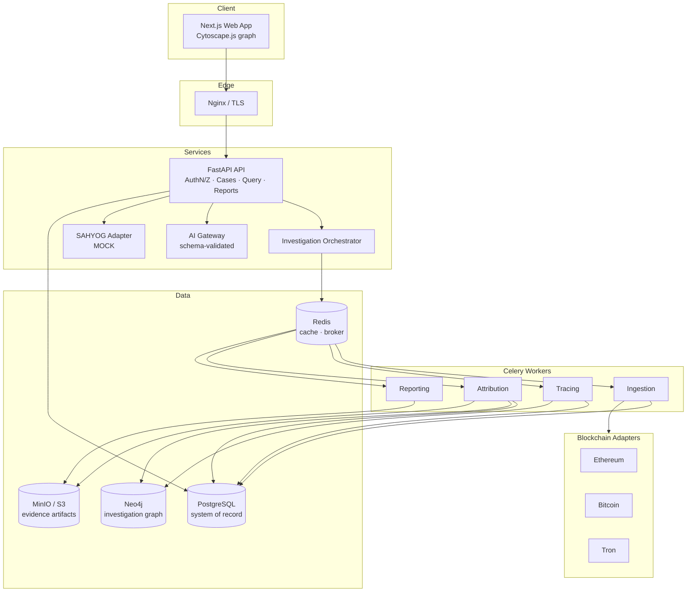
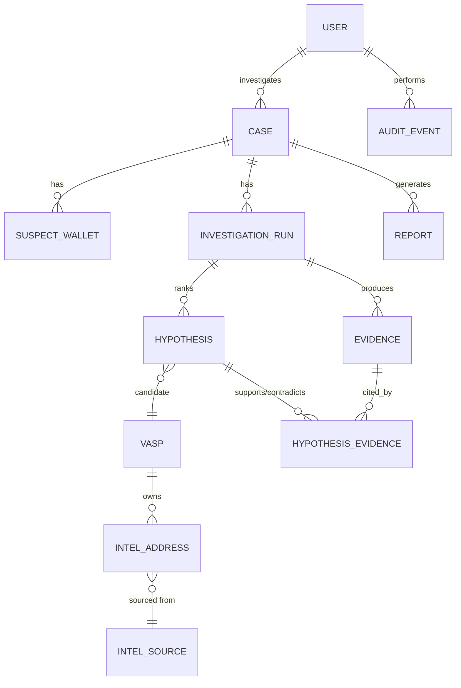
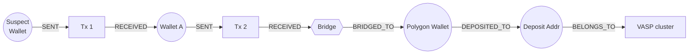
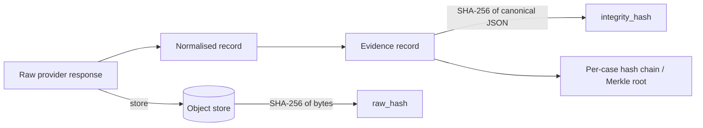
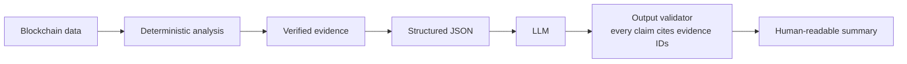
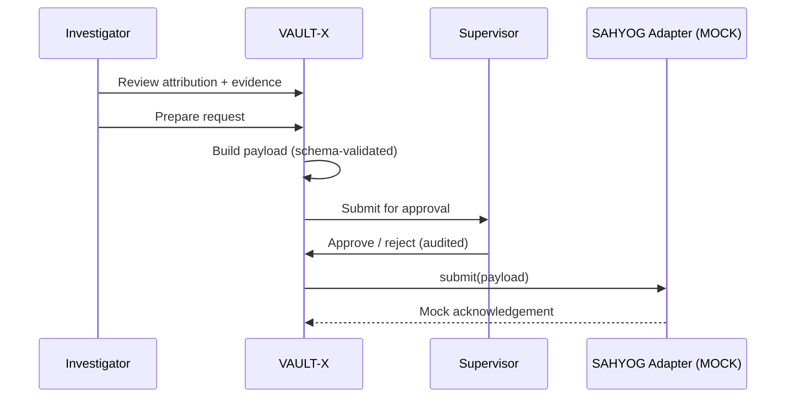

# VAULT-X

**Virtual Asset Unified Law-enforcement Tracing & Attribution Exchange**

> Given a suspect cryptocurrency wallet, VAULT-X traces the movement of funds, identifies the nearest likely direct-deposit-accepting VASP, explains exactly why that VASP was attributed, preserves the supporting evidence, exposes alternative explanations, and generates an investigation-ready case package.

| | |
|---|---|
| **Status** | SIH 2026 prototype (pre-MVP). See [Limitations](#36-limitations). |
| **Problem statement** | SIH 2026 — PS 26182 |
| **Integration target** | SAHYOG (prototype/mock boundary only — see [§35](#35-sahyog-integration-architecture)) |
| **Core differentiators** | Explainable attribution with a reproducible evidence chain; counterfactual analysis |

> **Naming note.** "VAULT-X" is kept as the working name. Before any public or pilot use, run a trademark/name-collision check; "VAULT" is a crowded namespace in the security industry.

---

## Table of contents

1. [Project title](#vault-x) · 2. [One-line description](#vault-x) · 3. [SIH problem statement](#3-sih-problem-statement-reference)
4. [Problem overview](#4-problem-overview) · 5. [Why it matters](#5-why-the-problem-matters) · 6. [Product vision](#6-product-vision)
7. [Core workflow](#7-core-workflow) · 8. [Differentiators](#8-key-differentiators) · 9. [Feature overview](#9-feature-overview)
10. [Architecture](#10-architecture) · 11. [Tech stack](#11-technology-stack) · 12. [Repo structure](#12-repository-structure)
13. [Installation](#13-installation) · 14. [Environment variables](#14-environment-variables) · 15. [Local development](#15-local-development)
16. [Docker](#16-docker-setup) · 17. [Database setup](#17-database-setup) · 18. [Provider setup](#18-blockchain-provider-setup)
19–21. [Running services](#19-running-the-backend) · 22. [API](#22-api-overview) · 23. [Database architecture](#23-database-architecture)
24. [Graph model](#24-graph-model) · 25. [Attribution](#25-vasp-attribution-methodology) · 26. [Confidence](#26-confidence-methodology)
27. [Risk](#27-risk-methodology) · 28. [Evidence integrity](#28-evidence-integrity) · 29. [Security](#29-security-architecture)
30. [AI](#30-ai-architecture) · 31. [Evaluation](#31-ground-truth-evaluation) · 32. [Example](#32-example-investigation)
33. [Screenshots](#33-screenshots) · 34. [Demo](#34-demo-workflow) · 35. [SAHYOG](#35-sahyog-integration-architecture)
36. [Limitations](#36-limitations) · 37. [Roadmap](#37-future-roadmap) · 38. [Responsible use](#38-responsible-use-statement)
39. [Team](#39-team) · 40. [License](#40-license)

---

## 3. SIH problem statement reference

**SIH 2026 — Problem Statement 26182: Automated Blockchain Intelligence & VASP Attribution Engine integrated with SAHYOG.**

The system must automatically analyse suspect wallet addresses, trace blockchain transactions, identify intermediary wallets/services, identify the nearest relevant VASP, provide confidence and supporting evidence for attribution, generate investigation-ready reports, and support lawful request routing through the SAHYOG ecosystem.

### Requirement traceability

| Requirement | VAULT-X capability | Section |
|---|---|---|
| Analyse suspect wallet | Wallet Investigation module | §9 |
| Trace transactions across intermediaries | Tracing engine (bounded, policy-driven) | §25 |
| Identify intermediary wallets/services | Entity resolution + service classification | §24–25 |
| Identify nearest direct-deposit VASP | VASP Attribution Engine | §25 |
| Confidence + evidence | Explainable Confidence Engine + Evidence Chain | §26, §28 |
| Investigation-ready reports | PDF/JSON report generator | §9 |
| Lawful request routing via SAHYOG | SAHYOG integration layer (**prototype/mock**) | §35 |

---

## 4. Problem overview

Law Enforcement Agencies (LEAs) routinely obtain cryptocurrency wallet addresses tied to cyber-fraud, ransomware, investment scams, darknet activity and laundering. The wallet alone is rarely actionable. Actionable intelligence is the **regulated entity** — a centralised exchange, custodial wallet, or other Virtual Asset Service Provider (VASP) — that can be served with a lawful request to disclose account holder (KYC) information.

Today an investigator must typically:

1. Identify the chain and pull transaction history from a public explorer.
2. Manually follow funds across intermediary wallets, sometimes across chains via bridges.
3. Recognise deposit addresses and hot wallets by hand or by consulting commercial tools.
4. Record why they believe a given address belongs to a given VASP.
5. Draft a request to that VASP with defensible supporting evidence.

Each step is slow, hard to reproduce, and hard to defend under scrutiny.

## 5. Why the problem matters

* **Time.** Funds move in minutes; lawful requests move in days. Faster, correct attribution shortens the window.
* **Correctness.** A wrong VASP attribution wastes a legal request, delays the case, and can implicate an uninvolved party. The cost of a false attribution is higher than the cost of "insufficient evidence".
* **Defensibility.** Attribution used in legal process must be explainable and reproducible by someone other than the analyst who produced it.
* **Consistency.** Outcomes should not depend on which investigator happened to know which exchange's address patterns.

## 6. Product vision

VAULT-X is a **case-centric investigation workstation**, not a block explorer. The investigator should be able to say:

> "I gave the system a suspect wallet, and it gave me the fund trail, the likely VASP, the evidence behind that conclusion, the uncertainty around it, the investigation timeline, and a structured next action."

Design principles: explainable, evidence-driven, reproducible, auditable, multi-chain, case-centric, secure, modular, API-first.

The core analysis is **deterministic and rule/evidence-based**. An LLM sits *above* that layer for query translation, summarisation and report drafting. It is never a source of truth.

## 7. Core workflow

```text
Find → Trace → Attribute → Explain → Validate → Preserve Evidence → Report → Route Lawful Request
```


## 8. Key differentiators

1. **Explainable VASP attribution with a reproducible evidence chain.** Every attribution is a bundle of typed, hashed evidence records, each traceable to a transaction or intelligence source. Re-running the investigation from its *run manifest* reproduces the result.
2. **Counterfactual investigation.** The engine scores *alternative* hypotheses (other VASPs, "unknown custodial wallet", "no attribution") using the same evidence, and lists what additional evidence would confirm or refute the primary hypothesis.
3. **Epistemic labelling.** Every fact in the UI and reports is labelled `Observed`, `Inferred`, `Attributed`, or `Uncertain`.
4. **Abstention as a feature.** When evidence is insufficient the system says so instead of guessing.
5. **AI kept above the evidence layer.** LLM outputs are schema-validated and every claim must cite evidence IDs.

## 9. Feature overview

| Tier | Feature | Summary |
|---|---|---|
| **P0** | Case management | Case ID, crime type, jurisdiction, investigator, suspect wallet, chain, incident date, status, timeline, history |
| P0 | Wallet investigation | Validation, chain ID, balance, tx count, first/last activity, in/out txs, token transfers, contract interactions, metadata |
| P0 | Multi-chain layer | Ethereum, Bitcoin, Tron (MVP) behind a normalised transaction model |
| P0 | Automated tracing | Configurable depth, direction, amount/time/tx filters, destination detection, path extraction |
| P0 | Investigation graph | Typed nodes/edges; zoom, pan, expand, path highlight, filters, risk/VASP highlight |
| P0 | VASP intelligence DB | Evidence-backed relationships between VASPs, deposit addresses, hot wallets, clusters, chains, sources, domains, jurisdictions |
| P0 | Attribution engine | Multi-signal evaluation → likely VASP, score, direct-deposit flag |
| P0 | Explainable confidence | "WHY THIS VASP?" with drill-down to underlying evidence |
| P0 | Evidence chain | Observation → Transaction → Intermediary → Deposit address → Entity relation → VASP attribution |
| P0 | Risk analysis | Indicator-based risk with contributing-factor explanation |
| P0 | Reports | PDF + JSON with methodology and audit information |
| P0 | Audit trail | Who did what to which resource, when, with what result |
| **P1** | Attribution proof chain | Clickable evidence reasons |
| P1 | Counterfactual engine | Alternative hypotheses; "what would confirm this?" |
| P1 | Investigation replay | Chronological timeline with per-event detail |
| P1 | Cross-chain tracing | Bridge-aware continuation of traces |
| P1 | Investigator assistant | NL → validated structured query (no DB access) |
| P1 | AI summary | LLM summarises *verified* evidence only |
| P1 | SAHYOG layer | Payload builder behind an adapter interface (**mock**) |
| P1 | Ground-truth framework | TEST-001…007 with measured metrics |
| **P2** | Advanced | Clustering, entity resolution, typology detection, monitoring/alerts, more chains, historical indexing, ML typologies, intel updates |

## 10. Architecture



Full detail: [`ARCHITECTURE.md`](ARCHITECTURE.md).

## 11. Technology stack

| Layer | Choice |
|---|---|
| Frontend | Next.js, TypeScript, Tailwind CSS, shadcn/ui, TanStack Query, Zustand, Cytoscape.js |
| Backend | Python 3.12, FastAPI, Pydantic v2, SQLAlchemy 2, Alembic |
| Datastores | PostgreSQL (system of record), Neo4j (graph), Redis (cache/broker) |
| Async | Celery + Redis |
| Chains | Ethereum: web3.py + EVM RPC · Bitcoin: Bitcoin Core RPC / compatible API · Tron: TronGrid |
| Analytics | NetworkX, Pandas, NumPy, scikit-learn (Neo4j for persisted graph queries) |
| Evidence storage | MinIO (local/demo), S3-compatible (production); SHA-256 integrity |
| Reports | PDF (server-side render), JSON |
| Deploy (MVP) | Docker, Docker Compose, Nginx, GitHub Actions |
| Observability | Prometheus, Grafana, OpenTelemetry, structured logging |
| Testing | pytest, pytest-asyncio, Vitest, Playwright, Locust |

Kubernetes is deliberately **not** part of the MVP.

## 12. Repository structure

```text
vault-x/
├── apps/
│   ├── web/                 # Next.js investigation workstation
│   └── api/                 # FastAPI service
├── workers/
│   ├── ingestion/           # chain data ingestion tasks
│   ├── tracing/             # fund-flow tracing tasks
│   ├── attribution/         # VASP attribution + counterfactuals
│   └── reporting/           # PDF/JSON report generation
├── packages/
│   ├── schemas/             # shared Pydantic/JSON-Schema models
│   ├── blockchain/          # BlockchainAdapter + chain implementations
│   ├── graph/               # graph model, Cypher, algorithms
│   └── intelligence/        # VASP intel model, heuristics, scoring
├── database/
│   ├── migrations/          # Alembic
│   └── seeds/               # VASP intel seed data (with provenance)
├── docs/
├── tests/
│   ├── unit/ integration/ e2e/ ground-truth/
├── docker/
├── scripts/
├── .env.example
├── docker-compose.yml
├── README.md · PRODUCT_SPECIFICATION.md · ARCHITECTURE.md
├── MVP_ROADMAP.md · DEMO_SCRIPT.md · EVALUATION.md
└── LICENSE
```

Python packages under `packages/` are installed in editable mode by the API and workers so that adapters, scoring and schemas have a single implementation.

## 13. Installation

**Prerequisites:** Docker ≥ 24 and Docker Compose v2; Python 3.12; Node.js 20 LTS + pnpm; `make` (optional).

```bash
git clone https://github.com/<org>/vault-x.git
cd vault-x
cp .env.example .env        # then edit values; never commit .env
```

## 14. Environment variables

```dotenv
# ---- App ----
APP_ENV=development
APP_SECRET_KEY=change-me                 # signing key for JWT; use a secret manager in prod
JWT_ACCESS_TTL_MIN=15
JWT_REFRESH_TTL_HOURS=12

# ---- PostgreSQL ----
POSTGRES_HOST=postgres
POSTGRES_PORT=5432
POSTGRES_DB=vaultx
POSTGRES_USER=vaultx
POSTGRES_PASSWORD=change-me

# ---- Neo4j ----
NEO4J_URI=bolt://neo4j:7687
NEO4J_USER=neo4j
NEO4J_PASSWORD=change-me

# ---- Redis / Celery ----
REDIS_URL=redis://redis:6379/0
CELERY_BROKER_URL=redis://redis:6379/1

# ---- Object storage ----
S3_ENDPOINT=http://minio:9000
S3_ACCESS_KEY=change-me
S3_SECRET_KEY=change-me
S3_EVIDENCE_BUCKET=vaultx-evidence

# ---- Blockchain providers ----
ETH_RPC_URL=                              # your provider; archive access recommended for history
BTC_RPC_URL=
BTC_RPC_USER=
BTC_RPC_PASSWORD=
TRONGRID_API_KEY=
TRONGRID_BASE_URL=https://api.trongrid.io
PROVIDER_MODE=live                        # live | snapshot  (snapshot replays recorded fixtures)

# ---- Pricing / FX (for INR amount filters) ----
PRICE_PROVIDER=                           # historical price source; record source in run manifest

# ---- AI (optional) ----
LLM_PROVIDER=
LLM_API_KEY=
LLM_MODEL=
AI_FEATURES_ENABLED=false

# ---- SAHYOG ----
SAHYOG_MODE=mock                          # mock only, until a real, authorised API spec exists
```

## 15. Local development

```bash
# Backend
python3.12 -m venv .venv && source .venv/bin/activate
pip install -e packages/schemas -e packages/blockchain -e packages/graph -e packages/intelligence
pip install -r apps/api/requirements-dev.txt

# Frontend
cd apps/web && pnpm install && cd ../..

# Backing services only
docker compose up -d postgres neo4j redis minio
```

## 16. Docker setup

```bash
docker compose up --build          # full stack
docker compose ps
docker compose logs -f api worker-ingestion
```

Services: `nginx`, `web`, `api`, `worker-ingestion`, `worker-tracing`, `worker-attribution`, `worker-reporting`, `postgres`, `neo4j`, `redis`, `minio`, `prometheus`, `grafana`.

## 17. Database setup

```bash
alembic -c apps/api/alembic.ini upgrade head          # PostgreSQL schema
python scripts/init_neo4j.py                          # constraints + indexes
python scripts/seed_intel.py --dataset demo           # VASP intel seed (provenance required)
```

The seed loader **rejects** any intelligence record without a `source` and `source_tier`. Seed data in the repository is limited to (a) synthetic records clearly marked `synthetic=true` for tests and (b) records derived from publicly documented sources with citations. It does not contain private exchange data.

## 18. Blockchain provider setup

| Chain | Requirement | Notes |
|---|---|---|
| Ethereum | JSON-RPC endpoint with historical access; log/trace support recommended | Internal transactions and token transfers need `eth_getLogs` and (ideally) trace APIs. Without traces, contract-internal ETH movements are incomplete — the UI flags this as a data-completeness warning. |
| Bitcoin | Bitcoin Core with `txindex=1`, or a compatible address-indexed API | Address history requires an index (e.g. an Electrum-style or explorer API); plain Core RPC does not index by address. |
| Tron | TronGrid API key | TRC-20 transfers (notably USDT) dominate; rate limits apply. |

Set `PROVIDER_MODE=snapshot` to run entirely from recorded fixtures (used for demos and CI). Snapshot runs are labelled as such in the UI and in reports.

## 19. Running the backend

```bash
uvicorn apps.api.main:app --reload --port 8000
# OpenAPI docs: http://localhost:8000/docs
```

## 20. Running the frontend

```bash
cd apps/web && pnpm dev            # http://localhost:3000
```

## 21. Running workers

```bash
celery -A workers.app worker -Q ingestion   -c 4 -n ingestion@%h
celery -A workers.app worker -Q tracing     -c 2 -n tracing@%h
celery -A workers.app worker -Q attribution -c 2 -n attribution@%h
celery -A workers.app worker -Q reporting   -c 1 -n reporting@%h
```

## 22. API overview

Base path `/api/v1`. All endpoints require a bearer JWT and are RBAC-checked; every state-changing call is audit-logged. Full reference: `docs/api.md` (generated from OpenAPI).

| Area | Endpoint | Purpose |
|---|---|---|
| Auth | `POST /auth/login`, `POST /auth/refresh` | Issue/refresh tokens |
| Cases | `POST /cases`, `GET /cases/{id}`, `PATCH /cases/{id}` | Case lifecycle |
| Wallets | `POST /cases/{id}/wallets` | Add suspect wallet; triggers chain identification |
| Wallets | `GET /wallets/{chain}/{address}` | Wallet profile |
| Investigations | `POST /cases/{id}/investigations` | Start a run (params → run manifest) |
| Investigations | `GET /investigations/{run_id}` | Status/progress |
| Graph | `GET /investigations/{run_id}/graph` | Nodes/edges (filterable) |
| Graph | `POST /investigations/{run_id}/expand` | Expand a node |
| Attribution | `GET /investigations/{run_id}/attribution` | Ranked hypotheses |
| Attribution | `GET /attributions/{id}/why` | Proof chain |
| Attribution | `GET /attributions/{id}/counterfactual` | Alternatives + evidence gaps |
| Evidence | `GET /evidence/{id}`, `POST /evidence/{id}/verify` | Record + integrity re-check |
| Replay | `GET /investigations/{run_id}/replay` | Chronological events |
| Reports | `POST /investigations/{run_id}/reports` | Generate PDF/JSON |
| Assistant | `POST /assistant/query` | NL → validated structured query |
| SAHYOG | `POST /attributions/{id}/sahyog/prepare` | Build payload (mock) |
| Audit | `GET /audit` | Filtered audit events (Auditor/Admin) |
| Intel | `GET/POST /intel/vasps`, `/intel/addresses` | Intelligence DB (Admin/Supervisor) |

## 23. Database architecture



Principal tables: `users`, `roles`, `cases`, `suspect_wallets`, `investigation_runs` (holds the run manifest), `transactions` (normalised), `addresses`, `vasps`, `intel_addresses`, `intel_sources`, `clusters`, `evidence`, `hypotheses`, `hypothesis_evidence`, `reports`, `sahyog_requests`, `audit_events`.

PostgreSQL is authoritative for cases, evidence records, intelligence and audit. Neo4j holds a **derived, rebuildable** graph projection for path queries and visualisation.

## 24. Graph model

**Nodes:** `Wallet`, `Transaction`, `VASP`, `Exchange`, `DepositAddress`, `HotWallet`, `SmartContract`, `Bridge`, `Mixer`, `DEX`, `Entity`.
**Edges:** `SENT`, `RECEIVED`, `BELONGS_TO`, `DEPOSITED_TO`, `WITHDRAWN_FROM`, `CONNECTED_TO`, `BRIDGED_TO`, `INTERACTED_WITH`.



Every edge carries `run_id`, `evidence_id`, and an epistemic label (`observed` for on-chain facts, `inferred` for heuristic links such as clustering).

## 25. VASP attribution methodology

"Nearest relevant VASP" = the first **VASP boundary** encountered along the traced value flow, measured by hop count and value share, where a boundary is a deposit address or hot wallet of an entity that accepts deposits.

**Pipeline**

1. **Trace** — bounded best-first traversal with a configurable *value-attribution policy* (default proportional/haircut; FIFO and "poison" selectable). The chosen policy is stored in the run manifest because it changes which paths appear.
2. **Terminal candidates** — addresses where flow stops or hits a known service.
3. **Signal extraction** per candidate (see table).
4. **Hypothesis generation** — one hypothesis per candidate VASP, plus `UNKNOWN_CUSTODIAL` and `NO_ATTRIBUTION`.
5. **Scoring** — combine supporting and contradicting evidence (§26).
6. **Counterfactual pass** — rank alternatives, list evidence gaps.

| Signal | Class | Description |
|---|---|---|
| Known deposit-address match | Direct | Address is recorded in intel DB as a deposit address of VASP *V* |
| Hot-wallet relationship | Direct/Structural | Candidate forwards funds to a known hot wallet of *V* |
| Cluster relationship | Inferred | Address is clustered with known *V* addresses (heuristic + provenance) |
| Sweep/consolidation behaviour | Behavioural | Many single-use addresses forward to one address soon after receipt |
| Deposit pattern | Behavioural | Fan-in from unrelated senders; low retained balance; stable forward target |
| Cross-chain corroboration | Structural | Same entity indicated on another chain via bridge/entity link |
| External intelligence | Provenance-weighted | Third-party label with a recorded source and tier |
| Contradicting evidence | Negative | Conflicting labels; funds continue to unrelated wallets; behaviour inconsistent with custodial deposit |

Chain-specific heuristics (e.g. common-input-ownership and change detection on Bitcoin) are **inferences**, are documented with known failure modes (CoinJoin, PayJoin), and are down-weighted or disabled when those conditions are detected. Shortest path alone never determines attribution.

## 26. Confidence methodology

The engine reports an **attribution score (0–100)** and a **band**, not a calibrated probability, until it has been calibrated against ground truth (§31).

* Each evidence item has a **source tier** (A: authoritative/attested, B: corroborated reputable, C: single/unverified) and a signal class with an initial likelihood-ratio weight.
* Weights combine in log-odds space. Evidence sharing the same **independence group** (e.g. two labels from the same upstream source) counts once at full weight, then with diminishing returns.
* Contradicting evidence subtracts. A critical contradiction (e.g. a tier-A label to a *different* VASP) caps the band.
* The result maps to bands: **High**, **Medium**, **Low**, **Insufficient**. Below the abstention threshold the primary result is `NO_ATTRIBUTION`.
* The scoring configuration is versioned and stored in the run manifest.

```json
{
  "hypothesis": "VASP_X",
  "score": 91,
  "band": "HIGH",
  "supporting": ["EV-0007", "EV-0011", "EV-0012", "EV-0015", "EV-0018", "EV-0021", "EV-0022"],
  "contradicting": ["EV-0030"],
  "scoring_config_version": "0.1.0",
  "calibrated": false
}
```

> The numbers above are illustrative of the *format*, not a measured result.

**"What would confirm this?"** — for each hypothesis the engine emits evidence gaps, e.g. *verify deposit-address ownership via lawful process*, *obtain VASP confirmation*, *find a second independent source for the label*.

## 27. Risk methodology

Risk is computed from **indicators**, each with a definition, data source, and contribution weight. The UI shows the contributing factors for every risk result.

| Indicator | Basis |
|---|---|
| Exposure to flagged addresses (fraud, ransomware, darknet, sanctions) | Intel DB label + hop distance + value share |
| Mixer interaction | Interaction with addresses/contracts classified as mixers |
| Rapid movement | Dwell time below threshold across successive hops |
| Peeling / splitting | Fan-out patterns |
| Consolidation | Fan-in patterns |
| Cross-chain movement | Bridge traversal |

Risk scores describe **transaction patterns and exposure**. They are not findings of criminal activity and are labelled `Inferred`.

## 28. Evidence integrity



Each evidence record contains: `evidence_id`, `case_id`, `run_id`, `type`, `source`, `tx_hash`, `timestamp`, `observed_data`, `collection_method`, `provider`, `raw_artifact_ref`, `raw_hash`, `integrity_hash`, `epistemic_label`. Records are append-only. A case-level Merkle root is stored with each report so a reader can verify the report against stored evidence. Nothing investigative is written to a public blockchain.

## 29. Security architecture

* **AuthN:** JWT access/refresh tokens; OAuth2/OIDC for SSO where an agency identity provider exists.
* **AuthZ:** RBAC with roles below; case-level access grants.
* **Audit:** append-only, hash-chained audit events for every read of case data and every mutation.
* **Secrets:** environment for dev; secret manager in production; no secrets in images or repo.
* **Transport/rest:** TLS everywhere; encryption at rest (database, object store) in production.
* **Least privilege:** separate DB roles per service; workers cannot read the audit log.
* **Retention:** configurable retention and legal-hold per case.
* **LLM boundary:** case-scoped, structured input only; no database credentials or free-form queries reach the model.

| Capability | Investigator | Supervisor | Auditor | Admin |
|---|:-:|:-:|:-:|:-:|
| Create/run own cases | ✓ | ✓ | – | – |
| View others' cases | – | ✓ (unit) | ✓ (read-only) | – |
| Approve SAHYOG payload | – | ✓ | – | – |
| Read audit log | – | – | ✓ | ✓ |
| Manage intel DB | – | propose | – | ✓ |
| Manage users/config | – | – | – | ✓ |

This is a prototype design; it has not been through a formal security assessment.

## 30. AI architecture



* **Investigator assistant:** the LLM maps a natural-language request to a **whitelisted query schema** (filters such as amount, currency, hop count, terminal type). The backend validates and executes it through the normal, RBAC-checked query layer. The model has no database access.
* **Summaries/reports:** the LLM receives verified evidence JSON only. A validator rejects output containing evidence IDs, addresses, hashes or amounts not present in the input.
* AI is optional (`AI_FEATURES_ENABLED`). All attribution and scoring works without it. AI-generated text is labelled as such in reports.

## 31. Ground-truth evaluation

Seven predefined scenario classes (`TEST-001`…`TEST-007`) cover known wallet → known VASP, intermediary, cross-chain, unknown wallet, ambiguity, mixer → exchange, and multiple candidate VASPs. Metrics: attribution accuracy, **false attribution rate**, abstention rate, trace completion, evidence completeness, cross-chain success, time-to-attribution, and calibration.

**No benchmark results are published in this repository until they are produced by the harness.** See [`EVALUATION.md`](EVALUATION.md). Results table:

| Metric | Result | Run ID / commit |
|---|---|---|
| Top-1 attribution accuracy | _not yet measured_ | – |
| False attribution rate | _not yet measured_ | – |
| … | _not yet measured_ | – |

## 32. Example investigation

> The following describes the **shape** of an investigation. Addresses, entity names and scores are placeholders unless the run is executed against real data and labelled accordingly.

```text
CASE CYBER-2026-001 · Investment Fraud · Ethereum
Suspect wallet: 0x7A…(placeholder)

Trace (depth 5, ≥ ₹50,000 per transfer, proportional policy)
  Suspect → Wallet A → Wallet B → Bridge → Polygon Wallet → Deposit Address

Attribution
  Primary:  VASP-X   score 91 (HIGH, uncalibrated)   Direct deposit: YES
  Supporting: 7 · Contradicting: 1

Alternatives
  VASP-Y                     supporting 2 · contradicting 5
  Unknown custodial wallet   supporting 1 · contradicting 6

Evidence gaps
  • Second independent source for deposit-address label
  • Lawful confirmation of deposit-address ownership
```

## 33. Screenshots

```text
docs/images/01-case-dashboard.png        (placeholder)
docs/images/02-investigation-screen.png  (placeholder)
docs/images/03-why-this-vasp.png         (placeholder)
docs/images/04-challenge-attribution.png (placeholder)
docs/images/05-replay.png                (placeholder)
docs/images/06-report-preview.png        (placeholder)
```

## 34. Demo workflow

1. Create case `CYBER-2026-001` (Investment Fraud).
2. Enter suspect wallet; chain auto-identified.
3. Trace runs; graph builds.
4. Attribution appears with score, band, direct-deposit flag.
5. **WHY THIS VASP?** → proof chain; click each reason to open the transaction/evidence.
6. **CHALLENGE ATTRIBUTION** → alternatives, contradicting evidence, evidence gaps.
7. **REPLAY** → chronological fund movement.
8. **REPORT** → PDF + JSON with integrity root.
9. **SAHYOG** → payload prepared (mock), pending supervisor approval.

The exact 3–5 minute script is in [`DEMO_SCRIPT.md`](DEMO_SCRIPT.md). Demos may run in `snapshot` mode; the UI shows a persistent **SNAPSHOT DATA** banner when they do.

## 35. SAHYOG integration architecture



* VAULT-X defines its own `SahyogClient` interface and payload schema. **We do not have access to a SAHYOG API specification or credentials.** The shipped implementation is a **mock** that validates and stores payloads locally and returns simulated acknowledgements.
* Every mock payload, UI screen and report section is labelled **"PROTOTYPE — NOT SUBMITTED TO ANY GOVERNMENT SYSTEM"**.
* A real integration requires: an official API specification, authorisation from the owning authority, security review, and legal review of the payload contents.
* Payloads contain only what the request needs: identifiers, evidence references, hashes, and a reasoned summary — not the full case file.

## 36. Limitations

* Prototype; not production-ready; no formal security or accuracy assessment.
* Attribution quality is bounded by the **intelligence database**. Open sources cover a fraction of real exchange address space; the system does not have private exchange data and does not claim to.
* Scores are uncalibrated until ground-truth runs are completed.
* Address clustering and deposit-address heuristics can be wrong; CoinJoin, custodial pooling, and shared infrastructure (e.g. payment processors) create false positives.
* Cross-chain tracing supports a limited registry of bridges.
* Data completeness depends on the RPC/API provider (traces, rate limits, pruning).
* Not real-time unless monitoring is explicitly enabled (P2).
* SAHYOG integration is a mock.
* Currency (₹) filters depend on historical price data whose source is recorded but may differ from an agency's accepted valuation method.

## 37. Future roadmap

Prototype → Technical MVP → Beta pilot → Production-grade LEA platform. See [`MVP_ROADMAP.md`](MVP_ROADMAP.md). Post-MVP: BNB Chain, Polygon, Solana adapters; address clustering; typology detection; monitoring/alerts; licensed intelligence-feed connectors; intel update workflows; calibration against real closed cases (with authorisation); formal security assessment; real SAHYOG integration if authorised.

## 38. Responsible-use statement

VAULT-X is designed for use by authorised law-enforcement personnel within applicable law and agency procedure.

* Output is **investigative lead generation**, not proof of guilt. Attribution to a VASP indicates where a lawful request may be directed, not that the VASP or any customer committed an offence.
* A wallet appearing in a trace is not evidence of wrongdoing by its holder; victims and innocent intermediaries appear in traces.
* Do not use outputs as the sole basis for enforcement action; verify through lawful process.
* The tool is not designed for surveillance of individuals without legal basis. Access is logged and reviewable.
* Report uncertainty honestly. Prefer "insufficient evidence" to a confident guess.

## 39. Team

| Name | Role | Contact |
|---|---|---|
| _TBD_ | Team lead / architecture | |
| _TBD_ | Backend / blockchain | |
| _TBD_ | Frontend / graph UX | |
| _TBD_ | Intelligence / data | |
| _TBD_ | Security / DevOps | |

Mentor / institution: _TBD_

## 40. License

_To be decided by the team._ Apache-2.0 is a reasonable default for open components; confirm SIH/institutional IP terms and third-party data licences (intelligence sources, price feeds, map/graph libraries) before publishing. Intelligence datasets may carry different licences from the code.
