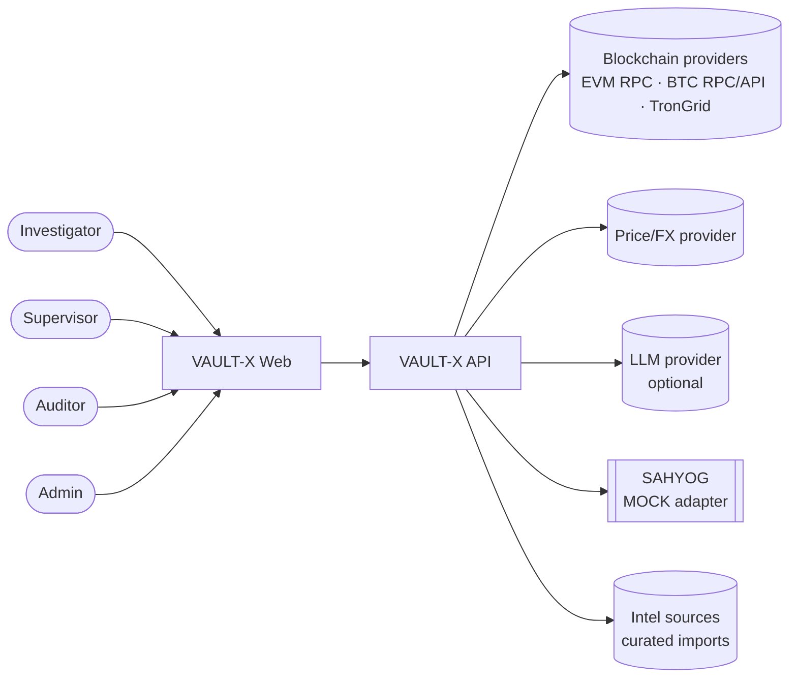
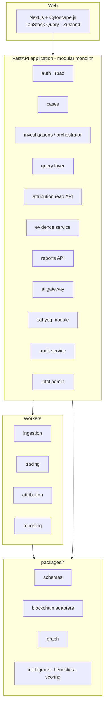
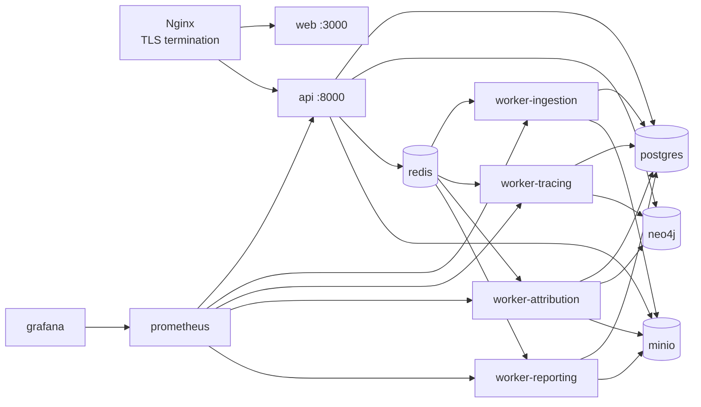
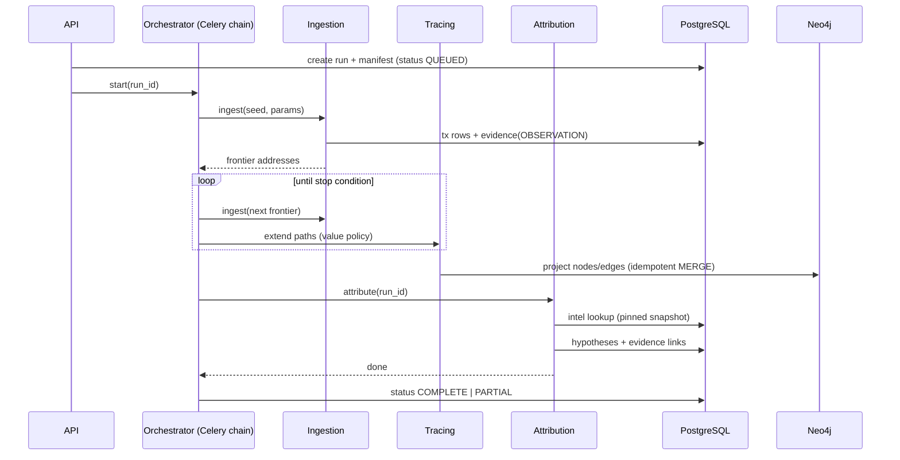
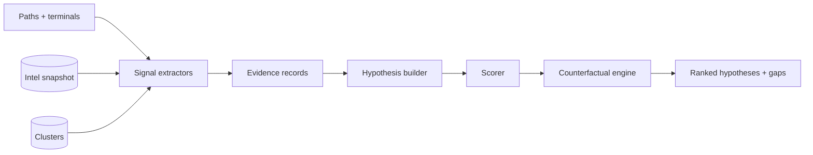
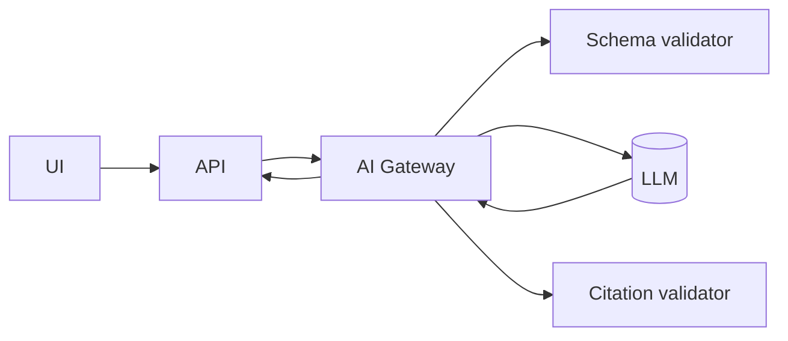
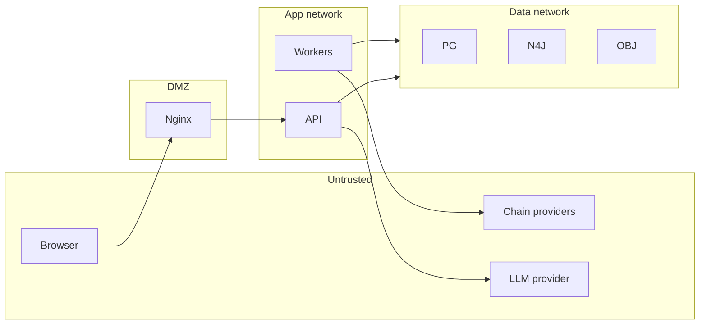

# VAULT-X — Architecture

Version 0.1 · Companion to `PRODUCT_SPECIFICATION.md`

---

## 1. Architectural principles

1. **Deterministic core, probabilistic edge.** Tracing, attribution and scoring are deterministic given pinned inputs. AI is confined to a gateway that only handles structured input/output.
2. **PostgreSQL is the system of record.** Neo4j is a derived, rebuildable projection.
3. **Adapters isolate chains.** Everything above the adapter sees one normalised model.
4. **Evidence is first-class.** Every derived fact points to evidence; evidence points to raw artifacts.
5. **Reproducibility by manifest.** A run is defined by parameters + code + data snapshot versions.
6. **Modular monolith first.** One FastAPI service with clear module boundaries and separate Celery worker pools; split into services only when load or team structure demands it. No Kubernetes in the MVP.
7. **Fail visible.** Partial data yields `PARTIAL` results with explicit warnings, never silent degradation.

---

## 2. System context



External dependencies and failure impact:

| Dependency | Used for | Failure impact | Mitigation |
|---|---|---|---|
| Chain providers | Transaction data | Trace incomplete | Retry/backoff, provider failover list, `PARTIAL` state, snapshot mode |
| Price provider | INR filters, report values | INR filters unavailable | Filter on native amounts; visible warning |
| LLM provider | Assistant, summaries | Feature unavailable | Deterministic templates; core unaffected |
| Intel sources | Attribution signals | Fewer signals | Pinned snapshot; imports are offline/curated, not runtime dependencies |

---

## 3. Logical architecture



### 3.1 Module responsibilities

| Module | Responsibility | Depends on |
|---|---|---|
| `schemas` | Pydantic v2 models + exported JSON Schema; single source for API, workers, LLM validation | – |
| `blockchain` | `BlockchainAdapter` implementations, rate limiting, retries, raw artifact capture | schemas |
| `graph` | Graph construction, Neo4j Cypher, path extraction, algorithms | schemas |
| `intelligence` | Intel DB access, signal extractors, hypothesis builder, scorer, counterfactual engine | schemas, graph |
| `apps/api` | HTTP, auth, orchestration, persistence | all packages |
| `workers/*` | Celery tasks calling package code | packages |

Dependency rule: packages never import from `apps/` or `workers/`; `intelligence` never calls providers directly.

---

## 4. Services and runtime topology (MVP)



Queues: `ingestion`, `tracing`, `attribution`, `reporting`, `ai` (optional). Separate queues let long ingestion jobs avoid starving attribution and report tasks.

---

## 5. Investigation pipeline



Properties:

* **Idempotent tasks.** Task inputs include `run_id` and step key; re-delivery does not duplicate rows (unique constraints on `(run_id, tx_hash, log_index/vout)` and `MERGE` in Neo4j).
* **Incremental progress.** Each stage writes results and emits progress events (SSE/WebSocket) so the UI renders progressively.
* **Cancellation.** Cooperative: tasks check a `cancel_requested` flag between batches.
* **Backpressure.** Per-provider token-bucket rate limiter in Redis, shared across workers.

---

## 6. Blockchain adapter layer

### 6.1 Interface

```python
class BlockchainAdapter(Protocol):
    chain: ChainId

    def validate_address(self, address: str) -> AddressValidation: ...
    def get_address_summary(self, address: str) -> AddressSummary: ...
    def iter_transactions(
        self, address: str, *, direction: Direction,
        start: datetime | None, end: datetime | None,
        cursor: Cursor | None = None,
    ) -> Iterator[Page[NormalizedTx]]: ...
    def get_transaction(self, tx_hash: str) -> NormalizedTxBundle: ...
    def get_token_transfers(self, address: str, **kw) -> Iterator[Page[NormalizedTx]]: ...
    def classify_address(self, address: str) -> AddressKind: ...  # EOA/contract/…
    def capabilities(self) -> AdapterCapabilities: ...            # traces, tokens, etc.
```

Every adapter returns `NormalizedTx` plus a `RawArtifact` (bytes + provider + request descriptor) so that raw responses can be hashed and stored.

### 6.2 Chain notes

| Chain | Data source | Model | Specific handling |
|---|---|---|---|
| Ethereum | web3.py + EVM JSON-RPC; `eth_getLogs` for ERC-20; trace API for internal txs if available | Account-based | ETH transfers, ERC-20 `Transfer` events, contract-call decoding for known routers/bridges; capability flag `internal_txs` drives the data-completeness warning |
| Bitcoin | Bitcoin Core (`txindex`) + address index/API | UTXO | Expand tx to input→output flows; proportional attribution across inputs/outputs; heuristics (common-input, change) live in `intelligence`, not in the adapter |
| Tron | TronGrid | Account-based | TRX + TRC-20 (USDT etc.); energy/bandwidth details ignored; address hex↔Base58 conversion |
| BNB/Polygon | EVM adapter with chain config | Account-based | Reuse EVM implementation via config (`chain_id`, RPC, explorer) |
| Solana (future) | RPC | Account/program | Separate adapter; token accounts model requires owner resolution |

### 6.3 Reliability

* Retries with exponential backoff + jitter; circuit breaker per provider.
* Provider failover list per chain (order in config); the manifest records which provider served which data.
* Finality: only blocks past a configurable confirmation depth are treated as final; unconfirmed data is flagged.
* **Snapshot mode:** adapters read from recorded fixtures (`tests/ground-truth/fixtures/…`) with the same interface, used for demos and CI.

### 6.4 Pricing

`PriceService` provides historical price at tx timestamp for (asset, INR) with recorded source and granularity. Amount filters in INR use this; the source is written to the manifest. Missing price → filter skipped with a warning.

---

## 7. Data architecture

### 7.1 PostgreSQL (system of record)

Key tables (abridged):

```sql
cases(id, case_ref, crime_type, jurisdiction, investigator_id, incident_date, status, created_at, ...)
suspect_wallets(id, case_id, chain, address, added_by, added_at)
investigation_runs(id, case_id, status, params jsonb, manifest jsonb, manifest_hash, started_at, finished_at)
addresses(chain, address, kind, first_seen, last_seen, PRIMARY KEY(chain, address))
transactions(id, chain, tx_hash, log_index, block_number, block_hash, ts, from_addr, to_addr,
             asset, asset_contract, amount_raw numeric, decimals, tx_type, status, raw_ref,
             UNIQUE(chain, tx_hash, log_index))
run_transactions(run_id, transaction_id, hop, path_key, value_traced numeric)
vasps(id, name, type, jurisdictions text[], domains text[], chains text[], status)
intel_sources(id, name, type, reference, licence, tier, independence_group, retrieved_at)
intel_addresses(id, chain, address, vasp_id, role, source_id, first_seen, last_seen, status,
                record_hash, snapshot_id)
intel_snapshots(id, created_at, content_hash, note)
clusters(id, method, version, ...) ; cluster_members(cluster_id, chain, address, basis)
evidence(id, case_id, run_id, type, epistemic_label, source, source_tier, tx_hash, ts,
         observed jsonb, collection_method, raw_ref, raw_hash, integrity_hash, seq, prev_hash)
hypotheses(id, run_id, kind, vasp_id, score, band, supporting_count, contradicting_count,
           direct_deposit, scoring_version)
hypothesis_evidence(hypothesis_id, evidence_id, polarity, weight, group)
reports(id, run_id, format, version, object_ref, sha256, merkle_root, generated_by, generated_at)
sahyog_requests(id, case_id, hypothesis_id, payload jsonb, status, mode, approved_by, ...)
audit_events(id, ts, user_id, case_id, action, resource_type, resource_id, result, ip, session_id,
             detail jsonb, prev_hash, hash)
```

Design notes:

* Amounts stored as `numeric` (raw integer units) — no floats.
* `evidence` and `audit_events` are append-only: enforced by DB permissions (no UPDATE/DELETE grants), plus `prev_hash`/`hash` chaining.
* Partition `transactions` by chain (and later by time) when volume warrants.
* Row-level security for case access in the production profile.

### 7.2 Neo4j (derived graph)

Constraints/indexes:

```cypher
CREATE CONSTRAINT wallet_key IF NOT EXISTS
  FOR (w:Wallet) REQUIRE (w.chain, w.address) IS NODE KEY;
CREATE CONSTRAINT tx_key IF NOT EXISTS
  FOR (t:Transaction) REQUIRE (t.chain, t.tx_hash) IS NODE KEY;
CREATE INDEX run_idx IF NOT EXISTS FOR ()-[r:SENT]-() ON (r.run_id);
```

Node labels: `Wallet`, `Transaction`, `VASP`, `Exchange`, `DepositAddress`, `HotWallet`, `SmartContract`, `Bridge`, `Mixer`, `DEX`, `Entity` (a node may carry multiple labels, e.g. `Wallet:DepositAddress`).
Relationships: `SENT`, `RECEIVED`, `BELONGS_TO`, `DEPOSITED_TO`, `WITHDRAWN_FROM`, `CONNECTED_TO`, `BRIDGED_TO`, `INTERACTED_WITH`.

Common properties: `run_id`, `evidence_id`, `epistemic` (`observed|inferred|attributed|uncertain`), `hop`, `value_traced`, `ts`.

Example query — paths from suspect to any VASP boundary within 6 hops for a run:

```cypher
MATCH p = (s:Wallet {chain:$chain, address:$addr})-[:SENT|RECEIVED*..12]->(d:DepositAddress)
       -[:BELONGS_TO]->(v:VASP)
WHERE ALL(r IN relationships(p) WHERE r.run_id = $run_id)
RETURN p, v.name
ORDER BY length(p)
LIMIT 50;
```

Because the graph is a projection, it can be dropped and rebuilt from PostgreSQL (`scripts/rebuild_graph.py --run r-0007`). Attribution scoring does **not** depend on Neo4j availability: path extraction for scoring uses the persisted `run_transactions` and in-memory NetworkX graphs; Neo4j serves exploration/visual queries. This prevents the graph store from becoming a hidden source of truth.

### 7.3 Redis

Uses: Celery broker/result backend, provider rate-limit buckets, short-TTL caches (address summaries, price lookups), pub/sub for progress events. Nothing in Redis is authoritative.

### 7.4 Object storage

Buckets: `evidence-raw` (provider responses, keyed by content hash), `reports`, `exports`. Server-side encryption in production; object lock (WORM) enabled on `evidence-raw` where the storage supports it.

---

## 8. Tracing engine

### 8.1 Algorithm (bounded value-flow traversal)

```text
frontier ← {(seed, traced_value = ∞ or total)}
for hop in 1..max_hops:
    for node in frontier ordered by (traced_value desc, address asc):
        txs ← adapter.iter_transactions(node, direction, window)
        for tx in filter(txs, amount, asset, dust):
            share ← policy.allocate(node, tx)            # proportional | FIFO | poison
            if share < min_value: record "pruned"; continue
            edge ← record(tx, share)
            classify(tx.counterparty)                    # service / contract / VASP boundary / mixer / bridge
            if stop_condition(counterparty): mark terminal(reason)
            else: next_frontier.add(counterparty, share)
        apply fan-out cap; record omitted count
```

### 8.2 Value-attribution policies

| Policy | Rule | Note |
|---|---|---|
| Proportional (default) | Outflows inherit tainted share = tainted_in / total_in at the time | Conservative, spreads taint, may over-include |
| FIFO | Oldest received funds leave first | Deterministic; sensitive to ordering |
| Poison | Any outflow from a tainted balance is fully tainted | Over-inclusive; useful for exploration |

The policy is a **methodological choice** and is recorded and displayed. Reports state the policy explicitly.

### 8.3 Classification at each hop

Order of checks: intel DB (VASP/deposit/hot wallet) → known contract registry (bridge, DEX, mixer, router) → cluster membership → behavioural classifier (deposit/sweep) → default `Wallet`.

### 8.4 Path extraction

* Value-weighted top-k paths via a modified Dijkstra on cost = −log(share) (so higher-value-share paths are "shorter").
* k-shortest (Yen) by hop count for explainability.
* Connected components/community detection for cluster views.
* Path outputs are inputs to attribution but **not** decisive on their own.

---

## 9. VASP attribution engine

### 9.1 Components



### 9.2 Signal extractors (pluggable)

Each extractor implements `extract(context) -> list[EvidenceCandidate]` and declares: `signal_class`, `epistemic_label`, `independence_group`, `failure_modes`, `version`.

| Extractor | Logic sketch |
|---|---|
| `KnownDepositMatch` | Exact `(chain, address)` in intel with role=deposit |
| `HotWalletForward` | Candidate outflows land on intel hot wallet of V; ≥ a threshold share within a window |
| `SweepBehaviour` | Candidate receives from many unrelated senders; forwards ≥ X% within T to a single target; low residual balance; address used sparsely |
| `DepositFanIn` | Sibling addresses (same forward target) show the same pattern → supports "deposit-address family" |
| `ClusterMembership` | Address clustered with V members (method, version, basis) |
| `CrossChainLink` | Bridge-paired counterpart address has evidence for V |
| `ExternalLabel` | Third-party label with source tier |
| `ContradictionLabel` | Label to different entity |
| `ContinuationContradiction` | Substantial value leaves candidate to non-VASP addresses beyond expected sweep behaviour |
| `MixerContamination` | Mixer on path between seed and candidate → cap |

### 9.3 Scoring

Log-odds combination: `logit(P) = prior + Σ_g max/decay(LR_i for i in group g) − Σ contradictions`, with source-tier multipliers (A > B > C). Initial priors and likelihood ratios are **hand-set defaults** in a versioned config (`scoring/0.1.0.yaml`) and are explicitly *not* calibrated probabilities. After ground-truth runs, calibrate (isotonic/Platt) and publish a calibration report; only then may the UI drop the `UNCALIBRATED` tag for that config version.

Banding and abstention thresholds are config values, evaluated against the false-attribution-rate target in `EVALUATION.md`.

Caps: mixer contamination, conflicting Tier-A labels, and cross-chain inference-only links each cap the maximum band.

### 9.4 Counterfactual engine

1. **Hypothesis set** = top-N VASP candidates by any positive signal ∪ {`UNKNOWN_CUSTODIAL`, `NO_ATTRIBUTION`}.
2. For each hypothesis compute supporting/contradicting evidence with the **same** evidence pool (evidence can support one hypothesis and contradict another).
3. **Sensitivity analysis:** remove each evidence item (leave-one-out) and re-score; report evidence whose removal changes the band or the ranking ("load-bearing evidence").
4. **Evidence-gap analysis:** for each hypothesis, evaluate a catalogue of *missing* evidence types (e.g. `second_independent_source`, `direct_label_for_deposit`, `confirmed_bridge_pairing`) and emit gap → action mappings.
5. Output: ranked hypotheses, load-bearing evidence, gaps, next actions.

### 9.5 Determinism

No randomness in scoring or tracing. Any sampling (future ML) uses fixed seeds recorded in the manifest. Output ordering has explicit tie-breakers.

---

## 10. Evidence subsystem

* **Evidence writer** is the only component allowed to insert evidence; it computes `integrity_hash = SHA256(canonical_json(record_without_hash_fields))` (RFC 8785-style canonicalisation) and `raw_hash = SHA256(raw_bytes)`.
* **Hash chain:** `hash_n = SHA256(prev_hash || integrity_hash_n)` per case sequence.
* **Merkle root:** computed over the case's evidence hashes at report time; stored with the report.
* **Verification service:** recomputes hashes from stored data and raw artifacts; endpoint `POST /evidence/{id}/verify` and bulk `POST /cases/{id}/verify`.
* **Chain of custody:** each evidence record carries collection method, provider, collector (user/system), and timestamp.
* **Immutability:** append-only permissions; corrections create new evidence with `supersedes`.
* Not on a public blockchain. Optional future: RFC 3161 trusted timestamping via an authorised TSA (privacy-preserving: only the root hash leaves the system).

---

## 11. AI gateway



| Use | Input to LLM | Output | Validation |
|---|---|---|---|
| Query interpretation | User text + query JSON Schema + minimal case context (chain names, asset list) | JSON matching schema | JSON Schema validate; whitelist fields; scope override by server |
| Summary | Verified evidence JSON (IDs, facts) | Structured summary with `claims[]`, each with `evidence_ids[]` | Every ID must exist in input; every address/hash/amount in text must appear in input; else reject/regenerate/fallback to template |
| Report drafting | Same as summary | Section drafts | Same |

Controls: no tool access, no DB credentials, no free-form retrieval; prompts and outputs logged (with redaction policy) for audit; temperature low; model/version recorded on the AI-generated artifact; AI text visibly tagged. PII minimisation: do not send victim personal data or free-text case notes unless the case-level AI toggle is enabled by a Supervisor.

---

## 12. API design

* REST + JSON, OpenAPI 3.1 generated from Pydantic v2 models; versioned under `/api/v1`.
* Long operations return `202` with a run/job ID; progress via Server-Sent Events `GET /investigations/{id}/events`.
* Pagination: cursor-based. Filtering: explicit query params validated by schema.
* Errors: RFC 7807 problem+json with stable error codes.
* Idempotency: `Idempotency-Key` header on creation endpoints.
* Rate limits per user/role at the gateway.
* All responses containing case data pass through the audit middleware.

Representative contract:

```http
POST /api/v1/cases/{case_id}/investigations
{
  "suspect_wallet_id": "…",
  "params": {"direction":"outgoing","max_hops":5,"min_amount":{"value":50000,"currency":"INR"},
             "window":{"from":"2026-03-01","to":"2026-04-01"},"value_policy":"proportional"}
}
→ 202 {"run_id":"r-0007","status":"QUEUED","manifest_hash":"sha256:…"}
```

---

## 13. Security architecture

### 13.1 Trust boundaries



Provider data is treated as **untrusted input**: validated against schemas, size-limited, and never interpolated into queries (parameterised Cypher/SQL only).

### 13.2 Controls

| Area | Control |
|---|---|
| Identity | JWT (short-lived access, rotating refresh), OIDC/OAuth2 SSO where available, MFA via IdP |
| AuthZ | RBAC (Investigator/Supervisor/Auditor/Admin) + per-case ACL; deny by default |
| Audit | Append-only, hash-chained; separate DB role; export to WORM storage in production |
| Secrets | Env in dev; secret manager (e.g. cloud KMS/secret store or Vault) in prod; rotation; no secrets in images/CI logs |
| Transport | TLS 1.2+; mTLS between services in production profile |
| At rest | Disk/DB encryption + S3 SSE-KMS in production |
| Least privilege | Per-service DB users; workers lack audit-log access; API lacks evidence UPDATE/DELETE |
| Input handling | Pydantic validation, address/tx-hash format checks, size limits |
| Dependencies | Lockfiles, `pip-audit`/`npm audit`, container scanning in CI |
| Frontend | CSP, no inline scripts, sanitised rendering (labels from third parties are untrusted text) |
| Data minimisation | SAHYOG payload builder allow-lists fields |
| Retention | Per-case policy, legal hold, secure deletion job with audit |
| LLM | See §11 |

### 13.3 Threats considered (abridged STRIDE)

| Threat | Example | Mitigation |
|---|---|---|
| Spoofing | Stolen token | Short TTL, MFA, session binding, revocation list |
| Tampering | Edit evidence to alter attribution | Append-only + hash chain + verification + WORM |
| Repudiation | Analyst denies viewing case | Audit on reads/writes |
| Info disclosure | Analyst browses unrelated cases | Per-case ACL, alerts on anomalous access |
| DoS | Expensive traces | Quotas, queue limits, fan-out caps, cancellation |
| Elevation | Role escalation | Central authz, tests for each endpoint |
| Data poisoning | Malicious label in intel import | Source tiers, dual review for tier-A, import diff review, versioned snapshots |
| Prompt injection | Malicious text inside tx metadata/labels | LLM gets structured fields only; free text from chain is not passed as instructions; output validated |

This is a design analysis, not an assessment result.

---

## 14. Observability

| Signal | Tooling | Key metrics |
|---|---|---|
| Metrics | Prometheus client in API/workers | `api_request_duration_seconds`, `queue_length{queue}`, `provider_errors_total{chain,provider}`, `investigation_duration_seconds`, `graph_projection_seconds`, `attribution_duration_seconds`, `evidence_verification_failures_total` |
| Traces | OpenTelemetry (API → Celery → provider calls) | End-to-end run traces with `run_id` attribute |
| Logs | Structured JSON, correlation IDs; PII/address redaction options | – |
| Dashboards | Grafana | Pipeline health, provider status, queue depth |
| Alerts | Prometheus rules | Provider failure rate, queue age, verification failure (page immediately) |

---

## 15. Deployment

### 15.1 MVP (Docker Compose)

```yaml
services:
  nginx:   { build: ./docker/nginx,  ports: ["443:443"], depends_on: [web, api] }
  web:     { build: ./apps/web }
  api:     { build: ./apps/api,  env_file: .env, depends_on: [postgres, neo4j, redis, minio] }
  worker-ingestion:   { build: ./workers, command: celery -A workers.app worker -Q ingestion   -c 4 }
  worker-tracing:     { build: ./workers, command: celery -A workers.app worker -Q tracing     -c 2 }
  worker-attribution: { build: ./workers, command: celery -A workers.app worker -Q attribution -c 2 }
  worker-reporting:   { build: ./workers, command: celery -A workers.app worker -Q reporting   -c 1 }
  postgres: { image: postgres:16, volumes: [pg:/var/lib/postgresql/data] }
  neo4j:    { image: neo4j:5,     volumes: [neo:/data] }
  redis:    { image: redis:7 }
  minio:    { image: minio/minio, command: server /data, volumes: [minio:/data] }
  prometheus: { image: prom/prometheus }
  grafana:    { image: grafana/grafana }
```

(Abridged; healthchecks, resource limits, networks and secrets omitted for brevity.)

### 15.2 CI/CD (GitHub Actions)

`lint → unit tests → integration tests (compose services) → ground-truth suite (snapshot mode) → build images → vulnerability scan → (manual) deploy`. Ground-truth metrics are stored as CI artifacts and compared against the previous run to detect regressions.

### 15.3 Environment profiles

| Profile | Purpose | Differences |
|---|---|---|
| `dev` | Local | Single-node, MinIO, mock SAHYOG, snapshot providers optional |
| `demo` | SIH demonstration | Snapshot mode default, seeded demo cases, banners on |
| `pilot` (future) | Agency beta | Managed Postgres/Neo4j, KMS, SSO, at-rest encryption, WORM audit, restricted network |
| `prod` (future) | Production | HA, DR, formal security assessment, monitored SLOs |

### 15.4 Path to production

```text
Load Balancer → API Gateway → FastAPI (N replicas) → Celery worker pools
                     ↓
   Managed PostgreSQL (HA) · Neo4j cluster · Redis (HA) · Object storage (WORM)
                     ↓
   Monitoring · Central logging · Secrets/KMS · Backup/DR
```

Introduce container orchestration only when horizontal scaling and operations demand it; the modular design does not preclude it.

---

## 16. Scalability

| Concern | Approach |
|---|---|
| Provider throughput | Shared rate limiter, caching of address pages, batch endpoints where available, worker concurrency tuned per chain |
| Large fan-out | Caps, aggregation, top-value truncation, progressive expansion |
| Graph size | Project only run-scoped subgraph to Neo4j; client-side element cap with server aggregation |
| Repeated investigations | Transaction cache keyed by `(chain, address, window)`; raw artifacts deduplicated by content hash |
| Intel growth | Indexed `(chain, address)`; snapshotting; bloom filter pre-check for large sets |
| Historical indexing (P2) | Own node/indexer for priority chains; columnar store (e.g. ClickHouse) for analytics — introduced only when provider APIs become the bottleneck |
| Multi-tenant agencies (future) | Tenant ID on all tables, RLS, per-tenant object prefixes and keys |

Scale claims are targets to be measured with Locust; no throughput numbers are asserted here.

---

## 17. Testing strategy (architecture-level)

| Layer | Tooling | Focus |
|---|---|---|
| Unit | pytest, pytest-asyncio | Adapters (recorded responses), normalisation, heuristics, scoring, hashing |
| Property-based | Hypothesis | Value-allocation policies conserve value; hash canonicalisation stable |
| Integration | pytest + compose | Pipeline end-to-end in snapshot mode; RBAC matrix; audit completeness |
| Ground truth | Custom harness | `TEST-001…007` (see `EVALUATION.md`) |
| Frontend | Vitest, Playwright | Component logic; demo flow e2e including WHY/CHALLENGE/REPLAY |
| Load | Locust | API + queue behaviour |
| Security | SAST, dependency/container scans, authz tests | Every endpoint × role |

---

## 18. Key design decisions and trade-offs

| Decision | Rationale | Trade-off |
|---|---|---|
| Modular monolith + workers | Small team, faster delivery | Less independent scaling |
| Postgres as record, Neo4j as projection | Avoid graph DB as hidden truth; easy rebuild | Duplicate storage; projection lag |
| Log-odds scoring with tiers | Transparent, auditable, tunable | Hand-set weights until calibrated |
| Deterministic tracing with recorded policy | Reproducible; methodologically explicit | Users must understand policy choice |
| AI at the edge only | Legal defensibility | Less "magic" in demo |
| Snapshot mode | Reliable demos, CI | Risk of misrepresenting as live → mitigated by banners |
| Mock SAHYOG | Honesty about access | Integration risk deferred |
| Open-source intel first | Feasible without commercial feeds | Coverage limited; the design allows licensed feed connectors later |
