# VAULT-X — MVP Roadmap

Version 0.1 · Sequenced by dependency, not by calendar. Effort figures are **planning estimates** in person-days for a team of ~4–5 and should be re-based after Phase 0.

```text
SIH Prototype → Technical MVP → Beta Pilot → Production-grade LEA Platform
```

## Overview

```mermaid
gantt
    dateFormat  X
    axisFormat  %s
    title Phase dependencies (relative, not calendar)
    section Foundation
    P0 Foundation           :p0, 0, 5
    section Data
    P1 Ingestion            :p1, after p0, 8
    P2 Graph engine         :p2, after p1, 7
    P3 VASP intelligence    :p3, after p0, 8
    section Intelligence
    P4 Attribution          :p4, after p2 p3, 9
    P5 Evidence             :p5, after p1, 6
    P7 Counterfactual       :p7, after p4 p5, 6
    section Product
    P6 Investigation UI     :p6, after p2, 12
    P8 Reporting            :p8, after p5 p4, 6
    P9 SAHYOG prototype     :p9, after p8, 4
    section Quality
    P10 Testing/evaluation  :p10, after p1, 30
```



| Phase | Name | Est. (person-days) | Depends on | Demo-critical |
|---|---|---|---|---|
| 0 | Foundation | 8–10 | – | ✓ |
| 1 | Blockchain ingestion | 14–18 | 0 | ✓ |
| 2 | Graph engine | 12–15 | 1 | ✓ |
| 3 | VASP intelligence | 10–14 | 0 | ✓ |
| 4 | Attribution | 14–18 | 2, 3 | ✓ |
| 5 | Evidence | 8–10 | 1 (parallel with 2–4) | ✓ |
| 6 | Investigation UI | 18–24 | 2 (progressive with 4, 5, 7) | ✓ |
| 7 | Counterfactual | 8–10 | 4, 5 | ✓ |
| 8 | Reporting | 8–10 | 4, 5 | ✓ |
| 9 | SAHYOG prototype | 4–6 | 8 | ✓ |
| 10 | Testing / evaluation | continuous, ~20+ | 1 onward | ✓ |

**Cut lines if time is short** (in order of what to defer first): Bitcoin heuristics beyond basic UTXO tracing → Tron internal edge cases → Hindi reports → assistant (P1 #17) → AI summary → cross-chain (keep one bridge as a scripted scenario). Do **not** cut: evidence chain, WHY panel, counterfactual view, abstention, mock labelling.

---

## Phase 0 — Foundation

**Objectives:** repo, tooling, identity/RBAC skeleton, schemas, CI, and the "honesty scaffolding" (banners, labels) so they exist from day one.

**Tasks**
1. Create monorepo per README §12; set up `pnpm` workspace and Python packages (editable installs).
2. Docker Compose: postgres, neo4j, redis, minio, api, web, nginx (dev profile).
3. FastAPI skeleton: settings (Pydantic), health, OpenAPI, error format (problem+json), request-ID middleware.
4. Auth: user table, password hashing (argon2), JWT issue/refresh, RBAC decorators for four roles; seed users per role.
5. Audit middleware v1 (writes `audit_events` with hash chain).
6. Alembic baseline migration: users, roles, cases, suspect_wallets, audit_events.
7. `packages/schemas`: `ChainId`, `NormalizedTx`, `Address`, `EpistemicLabel`, `Evidence`, `RunManifest`; JSON Schema export.
8. Next.js skeleton: layout with primary navigation, auth flow, theme, banner components (`SNAPSHOT`, `MOCK`, `UNCALIBRATED`).
9. CI: lint, type-check (mypy/tsc), unit tests, image build.
10. Decision records (`docs/adr/`): value policy default, scoring approach, snapshot-mode policy.

**Dependencies:** none.
**Expected output:** `docker compose up` yields login → empty Cases page; audit rows appear for logins and page reads.
**Definition of done:** CI green on main; each role can log in and sees only permitted navigation; RBAC test matrix exists for implemented endpoints; audit chain verification script passes.

---

## Phase 1 — Blockchain ingestion

**Objectives:** fetch and normalise data for ETH, BTC, Tron behind one adapter interface, with raw artifact capture and snapshot mode.

**Tasks**
1. Define `BlockchainAdapter` protocol and `AdapterCapabilities`.
2. Address validators for all three chains (checksum handling) with a shared test vector set.
3. `EthereumAdapter`: native transfers, ERC-20 transfer logs, block/time mapping, internal txs when trace API available; capability flags.
4. `BitcoinAdapter`: address history via chosen indexer/API; tx → input/output flow expansion; coinbase handling.
5. `TronAdapter`: TRX + TRC-20 transfers via TronGrid; address hex/Base58 conversion.
6. Raw artifact capture → object store with content-hash keys; `raw_ref` on transactions.
7. Rate limiter (Redis token bucket), retries with backoff/jitter, circuit breaker; provider failover config.
8. Pagination/cursor handling with resumable ingestion; reorg-safe (store block hash; confirmation depth).
9. `PriceService` with pluggable provider and recorded source.
10. Snapshot provider: record/replay fixtures with the same interface; CLI `scripts/record_fixture.py`.
11. Wallet investigation endpoints (`GET /wallets/{chain}/{address}`) + chain auto-identification.
12. Celery `ingestion` worker and task idempotency tests.

**Dependencies:** Phase 0.
**Expected output:** given an address on each chain, the API returns a wallet profile and a paginated normalised transaction list; the same request in snapshot mode returns identical data.
**Definition of done:**
* Adapter contract tests pass for each chain using recorded responses.
* Amounts stored exactly (property test: `raw → decimal → raw` round-trip).
* Ingestion of a 10k-transaction address completes without duplicate rows on retry (idempotency test).
* Data-completeness flags visible when trace API is unavailable.
* Fixtures recorded for all ground-truth scenarios that exist so far.

---

## Phase 2 — Graph engine

**Objectives:** build the tracing engine and investigation graph with reproducible, policy-explicit behaviour.

**Tasks**
1. Implement value policies (proportional, FIFO, poison) with conservation property tests.
2. Best-first tracing with hop/amount/time/asset filters, dust threshold, fan-out caps, omitted-count accounting; deterministic tie-breaking.
3. Stop-condition framework (VASP boundary, mixer, unresolved contract, max hops) with recorded reason.
4. Node classification pipeline hooks (intel → contract registry → cluster → behaviour → default).
5. Neo4j projection (idempotent `MERGE`), constraints/indexes; rebuild script.
6. Path extraction: value-weighted top-k, k-shortest by hops; connected components.
7. Graph API: `GET /graph` with filters, `POST /expand`, aggregation of super-nodes past element cap.
8. Bitcoin tracing specifics: per-flow allocation; heuristics interface (implemented in Phase 4).
9. Run orchestration: `investigation_runs`, manifest creation + hashing, status transitions, progress events (SSE), cancellation.
10. Determinism test: same manifest + same fixtures ⇒ identical graph hash.

**Dependencies:** Phase 1.
**Expected output:** starting a run on a fixture wallet produces a persisted graph and extracted paths; the graph can be fetched with filters.
**Definition of done:** determinism test passes across 50 repeated runs; value-conservation property tests pass; fan-out caps report omitted counts; graph rebuild from PostgreSQL reproduces the same graph hash; cancellation leaves the run in a consistent state.

---

## Phase 3 — VASP intelligence

**Objectives:** an evidence-backed intelligence store with provenance and versioning; **not** an `address → exchange` map.

**Tasks**
1. Schema + migrations: `vasps`, `intel_sources`, `intel_addresses`, `clusters`, `cluster_members`, `intel_snapshots`.
2. Import framework: CSV/JSON importers that **require** source, tier, licence, retrieval date; per-record hash; import diff report.
3. Source review: document each candidate source, licence, and independence group. Use only sources whose licence permits use; record the licence. Prefer sources with verifiable provenance (e.g. addresses published by the VASP itself, public sanctions listings, court/government publications, peer-reviewed or well-documented community datasets).
4. Seed datasets: (a) `synthetic` dataset for tests, flagged `synthetic=true`; (b) `demo` dataset from documented public sources with citations. No private data.
5. Snapshotting: immutable `intel_snapshots` with content hash; runs pin a snapshot.
6. Conflict handling: store conflicting labels; contradiction detection utilities.
7. Contract registry: bridges, DEX routers, mixers (address, chain, ABI/event signatures, source).
8. VASP admin UI/API (Admin create/edit; Supervisor propose; dual-approval for Tier A); every change audited.
9. Lookup API and bloom-filter pre-check.
10. VASP profile page (read): addresses by role with source and tier.

**Dependencies:** Phase 0 (parallelisable with Phase 1–2).
**Expected output:** query `(chain, address)` → labelled records with sources/tiers and snapshot ID.
**Definition of done:** importer rejects records lacking provenance (test); snapshot hash stable; 100% of seed records have source + tier + licence; conflict scenario demonstrably stored side by side; no seed record copied from a source whose licence disallows redistribution.

---

## Phase 4 — Attribution

**Objectives:** deterministic hypothesis generation and scoring with abstention.

**Tasks**
1. Signal extractor interface + registry with versioning and declared failure modes.
2. Implement extractors: `KnownDepositMatch`, `HotWalletForward`, `SweepBehaviour`, `DepositFanIn`, `ClusterMembership`, `ExternalLabel`, `ContradictionLabel`, `ContinuationContradiction`, `MixerContamination`, `CrossChainLink` (stub until Phase 7/cross-chain scenario).
3. Bitcoin heuristics (common-input-ownership, change detection) with CoinJoin/PayJoin detectors that disable inference.
4. Basic address clustering (heuristic-based, versioned) — enough to support `ClusterMembership`; full clustering stays P2.
5. Hypothesis builder (per-VASP + `UNKNOWN_CUSTODIAL` + `NO_ATTRIBUTION`).
6. Scorer: log-odds combination, tiers, independence groups, caps; config `scoring/0.1.0.yaml`.
7. Direct-deposit determination logic and basis output.
8. Attribution persistence: `hypotheses`, `hypothesis_evidence` with polarity/weight.
9. Attribution API (`/attribution`, `/attributions/{id}/why`).
10. Risk engine v1: indicator computation and contributing-factor output.
11. Unit tests per extractor with positive/negative/edge fixtures; ambiguity and abstention tests.

**Dependencies:** Phases 2 and 3 (evidence writer from Phase 5 can be stubbed first).
**Expected output:** for each ground-truth fixture, ranked hypotheses with scores, bands, evidence links.
**Definition of done:** TEST-001…004 scenarios run end-to-end; TEST-004 returns `NO_ATTRIBUTION`; TEST-005 returns `AMBIGUOUS`; scoring is deterministic (hash-stable); every score can be explained by listing evidence items and weights that sum to it (test); scoring config versioned and in manifest.

---

## Phase 5 — Evidence

**Objectives:** tamper-evident, verifiable evidence chain from observation to attribution.

**Tasks**
1. Evidence writer: canonical JSON, SHA-256, sequence + hash chaining, append-only DB permissions.
2. Evidence types: `OBSERVATION`, `TRANSACTION`, `INTERMEDIARY`, `DEPOSIT_ADDRESS`, `ENTITY_RELATIONSHIP`, `VASP_ATTRIBUTION`, `INTEL_RECORD`, `HEURISTIC_INFERENCE`.
3. Link ingestion → evidence (each stored transaction used in a path gets an observation evidence with `raw_ref`/`raw_hash`).
4. Verification service (single, bulk) + API + CLI.
5. Merkle root computation and storage; inclusion-proof generation.
6. Chain-of-custody fields (collector, provider, method).
7. Supersession model for corrections.
8. Evidence register UI data endpoints (search/filter).
9. Tamper tests: modify a row/hash/raw artifact → verification fails and audit event fires.

**Dependencies:** Phase 1 (can run in parallel with Phases 2–4, integrated as they land).
**Expected output:** every attribution reason resolves to hashed evidence with a passing verification.
**Definition of done:** tamper tests fail loudly; Merkle root reproducible; no code path inserts evidence outside the writer (lint/test); evidence completeness metric (defined in `EVALUATION.md`) computable.

---

## Phase 6 — Investigation UI

**Objectives:** the professional workstation experience and the demo flow.

**Tasks**
1. Design tokens/theme; dense layout; monospace address/hash components with copy/truncate.
2. Cases list/detail, case creation form with validation; timeline.
3. Wallet entry with chain detection UI (including EVM ambiguity handling).
4. Main investigation screen layout with progressive panels and stage status.
5. Cytoscape graph: node/edge styles by type + epistemic label, layered layout, zoom/pan, expand, path highlighting, filters (amount/time/asset/hop/risk/VASP), element cap with aggregation, accessible table alternative.
6. Attribution panel + Risk panel with contributing-factor accordions.
7. WHY drawer with clickable evidence → graph sync → integrity Verify.
8. Bottom action tabs: Evidence, Alternatives, Replay, Report, SAHYOG.
9. Evidence register, Graph Explorer, VASP Intelligence, Audit screens.
10. Persistent banners (`SNAPSHOT DATA`, `MOCK`, `UNCALIBRATED`).
11. State management: TanStack Query for server state, Zustand for graph/selection UI state; SSE progress hook.
12. Playwright e2e for the main story (steps 1–6).
13. Usability pass with ≥ 3 people unfamiliar with the project (record findings).

**Dependencies:** Phase 2 for graph; integrates Phases 4, 5, 7, 8 progressively.
**Expected output:** an investigator can complete Steps 1–5 of the demo without help.
**Definition of done:** Playwright main story passes in CI on snapshot data; graph remains interactive at the element cap on a mid-range laptop; keyboard navigation works for the drawer and tabs; no unlabeled synthetic data appears in the UI.

---

## Phase 7 — Counterfactual analysis

**Objectives:** alternative hypotheses, load-bearing evidence, evidence gaps, next actions.

**Tasks**
1. Alternative hypothesis ranking using the shared evidence pool.
2. Leave-one-out sensitivity analysis; identification of load-bearing evidence.
3. Evidence-gap catalogue and gap → action mapping (fixed catalogue, reviewed by a domain advisor).
4. What-if toggling in UI (local re-score via API endpoint that does not persist).
5. Cross-chain continuation: bridge registry, deposit/release pairing, `CrossChainLink` extractor, stop reasons.
6. Ambiguity detection (score margin threshold) and `AMBIGUOUS` presentation.
7. CHALLENGE view UI.
8. Tests: TEST-005, TEST-006, TEST-007 and TEST-003 scenarios.

**Dependencies:** Phases 4, 5.
**Expected output:** the CHALLENGE view for any run shows ≥ 2 alternatives, load-bearing evidence and next actions.
**Definition of done:** toggling evidence changes scores as expected in tests; ambiguous scenarios never present a single confident "likely VASP"; gap catalogue documented in `docs/attribution-engine.md`; cross-chain scenario traces across at least one supported bridge without manual intervention.

---

## Phase 8 — Reporting

**Objectives:** immutable, verifiable PDF/JSON reports.

**Tasks**
1. Report data model + JSON schema; JSON exporter including manifest.
2. PDF renderer (HTML→PDF or ReportLab) with the section list in the Product Specification §6.9; static graph rendering; consistent typography; page numbers; classification marking.
3. Integrity block: Merkle root, verification instructions, version stamps.
4. Deterministic executive summary template; optional AI summary (validator from Phase 9-adjacent AI gateway) clearly labelled.
5. Redaction levels (e.g. hide investigator identifiers for external sharing).
6. Report versioning and storage with SHA-256; report verification endpoint.
7. Async generation via `reporting` worker with progress.
8. Golden-file tests for JSON; visual regression for PDF pages.

**Dependencies:** Phases 4, 5.
**Expected output:** downloadable PDF and JSON for a completed run.
**Definition of done:** a third party can verify the report's Merkle root against exported evidence using the documented procedure (tested by a script); report states scoring version, uncalibrated status, data-completeness warnings, and mock/snapshot flags where applicable.

---

## Phase 9 — SAHYOG prototype

**Objectives:** a clearly labelled mock integration boundary with approval workflow; AI features behind the gateway.

**Tasks**
1. `SahyogClient` interface + `MockSahyogClient`.
2. Payload schema `vaultx.sahyog.request.draft/0.1`; validation; allow-list data minimisation.
3. Preparation UI: evidence checklist, officer-entered legal-basis fields, supervisor approval flow, mock acknowledgement (`MOCK-` IDs).
4. Guards: block preparation below configured band; block submit without approval.
5. Prominent prototype banner in UI, payload, and report section.
6. Document what a real integration would need (spec, authorisation, security/legal review) in `docs/sahyog-integration.md`.
7. AI gateway: query interpreter and summariser with schema + citation validators; feature flags; fallbacks.
8. Assistant UI with interpreted-query preview.
9. Tests: payload validation; attempted bypass of approval; AI validator rejecting invented IDs/addresses/amounts.

**Dependencies:** Phase 8.
**Expected output:** an approved mock request bundle for the demo case.
**Definition of done:** no UI/text anywhere implies real submission; approval enforcement tested; AI validator test suite (incl. adversarial inputs) passes; AI disabled ⇒ core flow unaffected.

---

## Phase 10 — Testing / evaluation (continuous from Phase 1)

**Objectives:** measure, don't assert.

**Tasks**
1. Ground-truth harness (`tests/ground-truth/`) with scenario definitions, fixtures, expected outcomes and metric computation (see `EVALUATION.md`).
2. Build TEST-001…007 datasets: controlled transactions on devnets/regtest/testnets where possible; documented, permitted real-chain scenarios; synthetic fixtures for edge cases.
3. Metric computation and reporting (JSON + markdown) stored per commit as CI artifacts.
4. Calibration analysis once ≥ N labelled cases exist; publish calibration plot and decide whether to drop `UNCALIBRATED`.
5. Unit/integration/e2e coverage targets; RBAC × endpoint matrix; audit completeness test.
6. Load tests (Locust): concurrent runs, provider-failure injection, queue saturation.
7. Security checks: SAST, dependency/container scanning, authz tests, prompt-injection tests for the AI gateway.
8. Reproducibility test: re-run from stored artifacts and compare hashes.
9. Demo rehearsal: run the script 3× on a clean environment; record timings; fix flakiness.

**Dependencies:** Phase 1 onward.
**Expected output:** a metrics report generated by the harness; a documented list of known failure cases.
**Definition of done:** harness runs in CI; results reported exactly as measured (including failures); false-attribution-rate reported alongside accuracy; limitations updated in README from actual findings.

---

## Beyond the MVP

| Stage | Exit criteria (indicative) |
|---|---|
| **Technical MVP** | All phases above complete; ground-truth suite in CI; reproducible demo in clean environment |
| **Beta pilot** | Agency environment (pilot profile): SSO, at-rest encryption, WORM audit, managed datastores; authorised intel sources/feeds; real SAHYOG spec + authorisation if available; user acceptance with real investigators under supervision; formal security assessment; calibration on authorised real cases |
| **Production** | HA/DR, SLOs and on-call, penetration test, data-protection and legal review, retention and disclosure processes, training and SOPs, multi-agency tenancy |

P2 backlog (order to be set by pilot feedback): address clustering & entity resolution, typology detection, advanced risk engine, VASP knowledge graph, alerts/real-time monitoring, BNB/Polygon/Solana, historical indexing, advanced cross-chain, ML typologies (with evaluation and explainability requirements), automated intel updates.

## Risks and mitigations

| Risk | Impact | Mitigation |
|---|---|---|
| Intel coverage too thin for convincing demo | Weak attribution | Controlled ground-truth via devnets and own-account deposits (where ToS permit); honest labelling of demo data |
| Provider rate limits/costs | Slow/failed ingestion | Snapshot mode, caching, failover, small demo scope |
| Bitcoin address indexing setup effort | Schedule | Use an address-indexed API for MVP; document Core+index as production route |
| Scope creep in UI | Delays | Freeze demo story (Phase 6) before polish; cut lines above |
| False attribution | Credibility, harm | Abstention thresholds, contradiction handling, false-attribution-rate as headline metric |
| Misperceived claims (AI/gov integration) | Trust | Persistent banners; wording review checklist |
| Legal/licence issues on data | Blocked release | Licence column mandatory in intel imports; legal review before publishing datasets |
