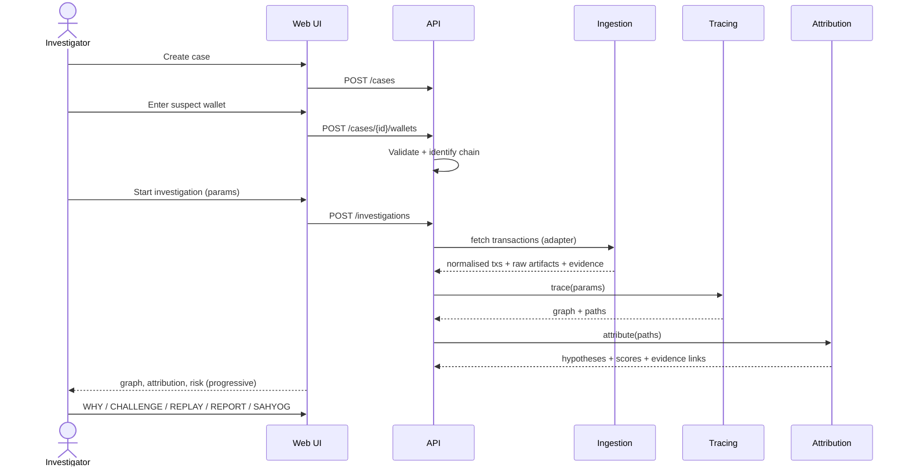

# VAULT-X — Product Specification

Version 0.1 (SIH prototype baseline) · Status: draft for team review

---

## 1. Purpose and scope

VAULT-X is a case-centric investigation workstation that takes a suspect wallet and produces a fund trail, a ranked set of VASP attribution hypotheses with explicit evidence, uncertainty analysis, a replayable timeline, an investigation report, and a prepared lawful-request payload.

**In scope (MVP):** Ethereum, Bitcoin, Tron; P0 and P1 features from the problem brief.
**Out of scope (MVP):** real-time monitoring, ML typology detection, real SAHYOG submission, Kubernetes deployment, chains beyond the three above.

### 1.1 Epistemic model (applies to every screen and report)

| Label | Meaning | Example |
|---|---|---|
| **Observed** | Directly read from chain data or a stored source artifact | "Tx 0xabc… moved 4.21 ETH from A to B at block N" |
| **Inferred** | Derived by a documented heuristic; may be wrong | "A and B are likely controlled by the same entity (common-input heuristic)" |
| **Attributed** | Assigned to a named entity based on scored evidence | "Address D is likely a deposit address of VASP X" |
| **Uncertain** | Evidence insufficient or conflicting | "Owner of E could not be determined" |

Labels appear as chips on graph edges, evidence rows, report sections, and AI-generated text.

### 1.2 Non-negotiable constraints

1. No fabricated attribution, transactions, or integrations.
2. LLM is never a source of truth.
3. Demo/snapshot data is always visibly labelled.
4. SAHYOG is a mock until an authorised API exists, and is labelled as such everywhere.
5. Abstention (`NO_ATTRIBUTION`) is a first-class outcome.

---

## 2. Personas

| Persona | Goals | Key needs | Permissions |
|---|---|---|---|
| **Investigator** (primary) — cybercrime cell officer | Turn a suspect wallet into an actionable VASP and defensible request | Speed, clarity, explainability, low training burden | Own cases: create, run, view, report, prepare requests |
| **Supervisor** | Review quality; approve outbound requests | Concise evidence summary, uncertainty visibility, audit of analyst actions | Unit cases: view, comment, approve/reject SAHYOG payloads, propose intel changes |
| **Auditor** | Verify process compliance | Immutable logs, reproducibility | Read-only cases metadata + audit; can trigger evidence verification |
| **Administrator** | Operate the platform | User/role management, intel DB curation, config | No case-content access by default; manages users, intel, config |
| **Prosecutor/Court reader** (indirect) | Read report | Self-contained report with methodology and verifiable hashes | Receives exported PDF/JSON |

### Investigator jobs-to-be-done

1. "I have a wallet from a victim's complaint — where did the money go?"
2. "Which exchange should I send a request to?"
3. "How sure are we, and what could be wrong?"
4. "Give me something I can attach to a request and defend later."

---

## 3. Navigation and information architecture

```text
Dashboard · Cases · Investigations · Wallet Intelligence · VASP Intelligence
Graph Explorer · Evidence · Reports · Alerts · Audit · Settings
```

| Section | MVP | Notes |
|---|---|---|
| Dashboard | ✓ | My cases, runs in progress, items awaiting supervisor action |
| Cases | ✓ | List/filter/search; case detail with timeline |
| Investigations | ✓ | Main investigation screen (§5) |
| Wallet Intelligence | ✓ | Lookup any address independent of a case (logged) |
| VASP Intelligence | ✓ (read) / Admin edit | VASP profile, known addresses with sources |
| Graph Explorer | ✓ | Full-screen graph with all filters |
| Evidence | ✓ | Searchable evidence register; integrity verification |
| Reports | ✓ | Generated reports, versions, hashes |
| Alerts | Stub | P2 monitoring; screen shows "not enabled" |
| Audit | ✓ (Auditor/Admin) | Filterable, exportable |
| Settings | ✓ | Trace defaults, providers status, profile |

---

## 4. End-to-end workflows

### 4.1 Primary investigation flow



### 4.2 Evidence flow

```text
Provider response ──► raw artifact (object store, SHA-256)
        │
        ▼
Normalised tx (PostgreSQL) ──► Observation evidence (hash)
        │
        ▼
Trace step / heuristic ──► Inference evidence (hash, method, params)
        │
        ▼
Intel lookup ──► Intel evidence (source, tier, hash of source record)
        │
        ▼
Hypothesis ──► supports / contradicts links
        │
        ▼
Report ──► includes Merkle root of case evidence at generation time
```

### 4.3 Investigation states

`DRAFT → QUEUED → INGESTING → TRACING → ATTRIBUTING → COMPLETE` with terminal alternatives `PARTIAL` (usable result, data gaps flagged), `FAILED`, `CANCELLED`. Case states: `OPEN → UNDER_REVIEW → REQUEST_PREPARED → REQUEST_SUBMITTED (mock) → CLOSED`, with `ON_HOLD`.

---

## 5. Screens

### 5.1 Case creation

| Field | Type | Validation |
|---|---|---|
| Case ID | Auto (`CYBER-YYYY-NNN`) or agency-provided | Unique |
| Crime type | Enum: Investment fraud, Ransomware, Phishing, Darknet, Sextortion, Money laundering, Other | Required |
| Jurisdiction | State/UT + police unit | Required |
| Investigator | Current user (editable by Supervisor) | Required |
| Incident date | Date | Not in the future |
| Description | Text | Optional; free text is not sent to LLM unless case AI toggle is on |
| Suspect wallet(s) | Address + optional chain hint | See §5.2 |

### 5.2 Wallet entry and chain identification

* Address format detection: Ethereum/EVM (`0x` + 40 hex, EIP-55 checksum validated if mixed case), Bitcoin (Base58 P2PKH/P2SH, Bech32/Bech32m), Tron (Base58, `T…`, checksum-validated).
* **EVM ambiguity:** an EVM address is valid on Ethereum, BNB Chain, Polygon, etc. The UI shows the candidate chains and, for each supported chain, activity summary; the investigator confirms. MVP supports only Ethereum for EVM; other EVM chains appear greyed as "adapter not enabled".
* Invalid checksum: blocking error with explanation. Unknown format: blocking error listing supported formats.
* No on-chain activity: allowed, with a warning ("address has no observed activity on selected chain"); investigation can still be saved.

### 5.3 Main investigation screen

```text
┌───────────────────────────────────────────────────────────────────────┐
│ CASE #CYBER-2026-001 · Investment Fraud      RUN r-0007 · COMPLETE    │
│ [SNAPSHOT DATA] banner when applicable                                │
├───────────────────────────────────────────────────────────────────────┤
│ SUSPECT WALLET  0x7A…  Ethereum  Bal: … · Txs: … · First/Last: …      │
├───────────────────────────────────────────────────────────────────────┤
│                         FUND-FLOW GRAPH                               │
│ [filters: depth · amount · time · asset · risk · VASP]  [expand]      │
│   Suspect → A → B → Bridge → Polygon W → Deposit → [VASP X]           │
├───────────────────────────────┬───────────────────────────────────────┤
│ ATTRIBUTION                   │ RISK                                  │
│ VASP X · score 91 · HIGH      │ HIGH (contributing factors ▾)         │
│ Direct deposit: YES           │ • Cross-chain movement                │
│ Supporting 7 · Contradicting 1│ • Rapid movement (< 30 min/hop)       │
│ [WHY THIS VASP] [CHALLENGE]   │ • Mixer exposure (hop 2)              │
├───────────────────────────────┴───────────────────────────────────────┤
│ [EVIDENCE] [ALTERNATIVES] [REPLAY] [REPORT] [SAHYOG]                  │
└───────────────────────────────────────────────────────────────────────┘
```

**Behaviour**

* Panels update progressively as pipeline stages complete; each shows its own stage status.
* Graph selection syncs with the right-hand panel (selecting a node shows its profile, labels, and evidence).
* "Score" is displayed with a visible `uncalibrated` tag until calibration is completed for the scoring version in use.
* The primary hypothesis never appears without its contradicting-evidence count.

### 5.4 Graph interaction spec

| Capability | Behaviour |
|---|---|
| Zoom/pan | Mouse/trackpad; fit-to-view; mini-map |
| Node expansion | Double-click loads next N neighbours (respecting filters); cap per expansion (default 25, ranked by value) with "show more" |
| Path highlighting | Select destination → highlight all extracted paths, with value share; k-shortest and top-value paths selectable |
| Filtering | Amount (native and INR), time range, asset, hop depth, node type, risk level, VASP |
| Risk highlighting | Node/edge colour scale + icon; colour is never the sole indicator (accessibility) |
| VASP highlighting | Distinct shape + label for VASP boundary nodes |
| Layout | Left-to-right layered by hop by default; force layout optional |
| Performance | Client renders ≤ ~2,000 elements; beyond that, server-side aggregation collapses fan-out into "N addresses" super-nodes with drill-down |
| Edge styling | Solid = observed; dashed = inferred; dotted = uncertain |

### 5.5 WHY THIS VASP? — proof chain

Opens a right-hand drawer:

```text
Attribution: VASP X — score 91 (HIGH)

Reasons (click to expand)
 ✓ Known deposit-address match            [Tier A · source: …]     +
 ✓ Hot-wallet consolidation               [Observed · 14 sweeps]   +
 ✓ Cluster relationship                   [Inferred · heuristic v1]+
 ✓ Consistent deposit behaviour           [Behavioural]            +
 ✓ Independent corroborating evidence     [Tier B · source: …]     +
 ✗ Contradicting: one label to VASP Y     [Tier C · low weight]    +

Proof chain
 OBSERVATION → TRANSACTION → INTERMEDIARY → DEPOSIT ADDRESS → ENTITY REL. → VASP
```

Each reason expands to: evidence ID, type, epistemic label, source and tier, tx hash/block/timestamp (with explorer link), observed data, collection method, integrity hash + **Verify** button, and its contribution to the score. Clicking a tx highlights it on the graph.

### 5.6 CHALLENGE ATTRIBUTION — counterfactual view

```text
PRIMARY   VASP X                 supporting 7 · contradicting 1
ALT 1     VASP Y                 supporting 2 · contradicting 5
ALT 2     Unknown custodial wallet   supporting 1 · contradicting 6
ALT 3     No attribution         (baseline)

For each hypothesis:
  • Supporting evidence (linked)     • Contradicting evidence (linked)
  • What would confirm it            • What would refute it
  • Suggested next actions
```

**Suggested next actions** are drawn from a fixed catalogue (never LLM-invented), e.g.:

| Gap detected | Suggested action |
|---|---|
| Deposit label has a single Tier-C source | Seek second independent source; verify against exchange-published addresses if any |
| Candidate forwards to hot wallet but no deposit-address label | Verify deposit-address ownership through lawful process |
| Funds continue beyond candidate | Extend trace depth beyond candidate; check for pass-through service |
| Bridge link ambiguous | Manually confirm bridge event pairing |
| Mixer on path | Treat downstream attribution as low-confidence; consider alternative tracing policy |

Investigator can **toggle evidence off** ("what if this label is wrong?") to see how scores change. This is a local what-if, not persisted unless saved as an annotated scenario.

### 5.7 Replay

Chronological list (and scrubber) of events in the primary path:

```text
09:31  Suspect Wallet   sends 4.21 ETH → Wallet A
09:34  Wallet A         …
10:02  Bridge           deposit event
10:07  Polygon Wallet   bridge release
10:14  Deposit Address  receives …
10:15  VASP cluster     sweep to hot wallet
```

Timestamps are chain timestamps (UTC, displayed with IST toggle). Event detail: tx hash, block, timestamp, asset, amount (native + INR at time of tx with price source), source of data, linked evidence, and **attribution contribution** (which hypothesis it supports/contradicts and by how much). Playback highlights the corresponding graph element. Cross-chain events are ordered by timestamp with an explicit note about clock differences between chains.

### 5.8 Report screen

Options: sections to include, language (EN; Hindi as a stretch goal), redaction level, include AI summary (toggle), format (PDF/JSON). Preview with page count; generation is asynchronous. Every report version is immutable and carries: run ID, manifest hash, evidence Merkle root, generator version, scoring-config version, timestamp, user.

### 5.9 SAHYOG preparation screen (prototype)

Steps: select attribution → review evidence checklist → edit request fields → supervisor approval → mock submission → mock acknowledgement. A fixed banner reads **PROTOTYPE — NOT SUBMITTED TO ANY GOVERNMENT SYSTEM**. See §9.

### 5.10 Investigator assistant

Side panel with a text box and quick prompts. Response shows the **interpreted structured query** (editable) before execution so the investigator can see exactly what will run, then results in the graph/table. See §8.

---

## 6. Feature behaviour

### 6.1 Case management

Timeline auto-populates from audit events relevant to the case (wallet added, run started, attribution viewed, report generated, request prepared). Notes are user-authored, versioned, and marked as `Investigator note` (never conflated with evidence). Cases can be reassigned by a Supervisor; reassignment is audited.

### 6.2 Wallet investigation

Returns: validity, chain, balance (native + tokens with pricing where available), transaction count, first/last activity, incoming/outgoing lists (paginated), token transfers, contract interactions, address type (EOA/contract/…), known labels (from intel DB with sources). Data completeness indicators: `Complete`, `Partial (no traces)`, `Partial (rate-limited)`.

### 6.3 Normalised transaction model

```json
{
  "chain": "ethereum",
  "tx_hash": "0x…",
  "block_number": 123456,
  "timestamp": "2026-03-14T09:31:07Z",
  "from": "0x…",
  "to": "0x…",
  "asset": "ETH",
  "asset_contract": null,
  "amount": "4.210000000000000000",
  "amount_raw": "4210000000000000000",
  "decimals": 18,
  "transaction_type": "TRANSFER",
  "status": "SUCCESS",
  "log_index": null,
  "trace_path": null,
  "provider": "…",
  "raw_ref": "s3://…"
}
```

Amounts are stored as exact decimal strings plus raw integers; no floating-point arithmetic on values. `transaction_type` ∈ `TRANSFER`, `TOKEN_TRANSFER`, `CONTRACT_CALL`, `INTERNAL`, `BRIDGE_DEPOSIT`, `BRIDGE_RELEASE`, `SWAP`, `MINT`, `BURN`. Bitcoin transactions are modelled as UTXO transactions with an expansion into per-input/per-output flows; each flow references the parent `tx_hash` and `vout`.

### 6.4 Tracing

| Parameter | Default | Notes |
|---|---|---|
| Direction | Outgoing | Incoming/both supported |
| Max hops | 5 | Hard cap configurable by admin |
| Min amount | ₹0 (off) | Native or INR; INR uses recorded price source |
| Time window | Incident date → +30 days | |
| Assets | All | |
| Value policy | Proportional | FIFO / poison optional |
| Stop conditions | VASP boundary, mixer, contract with unresolved custody, max hops, dust threshold | Each stop reason is recorded on the terminal node |
| Fan-out cap | 50 per node per hop (top by value) | Skipped edges counted and shown ("+312 smaller transfers omitted") |

Traversal is best-first by remaining traced value. Ordering and truncation are deterministic (tie-break by tx hash) so runs are reproducible.

### 6.5 VASP intelligence

Entities: `VASP` (name, type: exchange/custodial wallet/payment processor/OTC/…, jurisdictions, official domains, supported chains, LEA contact route if publicly documented), `IntelAddress` (address, chain, role: deposit / hot / cold / withdrawal, VASP, source, source tier, first/last seen, status), `Cluster` (member set, method, version), `IntelSource` (name, type, URL/reference, licence, retrieval date, tier, independence group).

Curation rules: no record without a source; conflicting labels are stored side by side, not overwritten; every change is versioned and audited; retired labels are kept with `status=retired`.

### 6.6 Attribution engine behaviour

1. Terminal candidate discovery.
2. Signal extraction (see README §25).
3. Hypothesis construction per candidate VASP + `UNKNOWN_CUSTODIAL` + `NO_ATTRIBUTION`.
4. Scoring and banding (README §26).
5. Direct-deposit determination: YES if the candidate address is a deposit address (labelled or behaviourally inferred, with which basis shown); NO if the funds reach a VASP only via a non-depositing path (e.g. withdrawal wallet); `UNKNOWN` otherwise.
6. Output ranked hypotheses and persist links to evidence.

### 6.7 Risk

Computed per node and per path, with each contributing indicator listed (name, value, weight, evidence link). Overall bands: Low/Medium/High/Critical with thresholds in config. Risk output is labelled `Inferred` and carries the responsible-use notice.

### 6.8 Cross-chain

Bridge registry entries define: bridge contract addresses per chain, deposit event signature, release event signature, correlation key (e.g. nonce/message ID), typical latency. The tracer pairs a deposit with its release by correlation key; if pairing is by amount/time heuristic only, the link is `Inferred` with lower weight. Unsupported bridges terminate the path with a `BRIDGE_UNSUPPORTED` stop reason and an action suggestion ("manual continuation required").

### 6.9 Report contents

1. Cover: case, investigator, supervisor, run ID, generated-at, classification marking.
2. Executive summary (deterministic template; optional AI paragraph clearly labelled).
3. Suspect wallet profile.
4. Transaction summary and table.
5. Fund-flow graph (static rendering) and path tables.
6. Attribution: primary hypothesis, direct-deposit determination, score, band, uncalibrated notice.
7. Evidence chain with IDs and hashes.
8. Alternative hypotheses and evidence gaps.
9. Risk indicators.
10. Timeline (replay).
11. Methodology (versions of tracer, heuristics, scoring config, intel snapshot, price source, providers).
12. Limitations and data-completeness notes.
13. Audit information and integrity block (Merkle root, verification instructions).
14. Appendix: full transaction hashes.

JSON export contains the same content in a documented schema plus the run manifest.

---

## 7. Investigation reproducibility

Each run stores a **run manifest**:

```json
{
  "run_id": "r-0007",
  "case_id": "CYBER-2026-001",
  "created_at": "…",
  "params": {"max_hops": 5, "min_amount_inr": 50000, "value_policy": "proportional"},
  "code_version": "git:abc1234",
  "scoring_config_version": "0.1.0",
  "heuristics_version": "0.1.0",
  "intel_snapshot": "intel-2026-03-14T00:00Z#sha256:…",
  "bridge_registry_version": "…",
  "price_source": "…",
  "providers": [{"chain":"ethereum","name":"…","mode":"live|snapshot"}],
  "input_data_hash": "sha256:…"
}
```

`POST /investigations/{id}/rerun` re-executes against the stored raw artifacts and the pinned intel snapshot; outputs must match the original by hash, or the diff is shown. Live re-fetch is a separate, explicit action ("refresh data") that creates a new run.

---

## 8. Investigator assistant (NL → structured query)

**Flow:** user text → LLM (with schema + case-scoped context summary, no credentials) → JSON → server-side validation against the query schema → editable preview → execution through the standard query layer.

**Query schema (illustrative):**

```json
{
  "scope": {"case_id": "CYBER-2026-001", "run_id": "r-0007"},
  "filters": {
    "amount": {"min": 500000, "currency": "INR"},
    "path": {"must_include_intermediary": true, "terminal_type": "VASP"}
  },
  "return": ["paths", "transactions"],
  "limit": 100
}
```

Example: "Show transactions above ₹5 lakh that passed through an intermediary before reaching a VASP." → amount ≥ 500,000 INR, `must_include_intermediary`, `terminal_type=VASP`.

**Guardrails:** operations limited to read-only whitelisted filters; scope forced to the user's accessible cases; unknown fields rejected; ambiguous requests return a clarifying question rather than a guess; the preview shows the interpretation; all requests and interpretations are audited. If the model output fails validation the UI reports "could not interpret" and offers the manual filter panel.

---

## 9. SAHYOG integration (prototype)

### 9.1 Position

We do not have the SAHYOG API specification, credentials, or authorisation. The MVP defines an **internal adapter boundary** and a **mock implementation**. All UI, logs and documents state this.

### 9.2 Flow

`VASP identified → evidence review → request preparation → supervisor approval → payload → adapter.submit() → acknowledgement`.

### 9.3 Payload (VAULT-X-defined draft schema)

```json
{
  "schema": "vaultx.sahyog.request.draft/0.1",
  "mode": "MOCK",
  "case_ref": "CYBER-2026-001",
  "requesting_unit": {"name": "…", "jurisdiction": "…"},
  "officer": {"id": "…", "role": "…"},
  "target_vasp": {"name": "VASP X", "vasp_id": "…", "channel": "as recorded in intel DB"},
  "subject_identifiers": [{"chain": "polygon", "address": "0x…", "role": "deposit_address"}],
  "transactions": [{"chain": "polygon", "tx_hash": "0x…", "timestamp": "…", "asset": "USDT", "amount": "…"}],
  "attribution": {"score": 91, "band": "HIGH", "calibrated": false, "evidence_ids": ["EV-…"]},
  "evidence_bundle_ref": {"report_id": "…", "merkle_root": "sha256:…"},
  "legal_basis": {"provision": "<entered by officer>", "authority_ref": "<entered by officer>"},
  "requested_information": ["<selected by officer from a checklist>"],
  "approval": {"supervisor_id": "…", "approved_at": "…"}
}
```

The `legal_basis` and `requested_information` fields are **officer-entered**; VAULT-X does not generate legal claims.

### 9.4 Edge cases

* Attribution band below configured threshold → payload preparation blocked, with reason.
* No supervisor approval → cannot submit.
* Mock mode → acknowledgement is simulated with a `MOCK-` prefix and never displayed as a real reference number.
* Payload data minimisation: full case narrative and unrelated graph data are excluded by default.

---

## 10. Edge cases and error states

| Situation | Behaviour |
|---|---|
| Provider outage / rate limit | Retry with backoff; run becomes `PARTIAL` with a banner naming the affected chain and time range; results not silently degraded |
| Provider returns inconsistent data across retries | Flag as data-integrity warning; keep both raw artifacts |
| Chain reorg after ingestion | Store block hash; a `REFRESH` detects mismatch and marks affected evidence `superseded` |
| Address is a smart contract | Show contract type if known; tracing follows token/ETH flows per event logs; unresolved custody → stop reason |
| Very high-degree node (exchange hot wallet, airdrop) | Fan-out cap; aggregate node; never expand automatically |
| Dust / poisoning attack transactions | Dust threshold filter; flagged, excluded from attribution by default |
| Bitcoin CoinJoin / PayJoin | Common-input and change heuristics disabled for the transaction; link marked `Uncertain` |
| Mixer on path | Trace stops or continues in "probabilistic" mode (P2); attribution downstream is capped at Low |
| Bridge unsupported / unpaired | Stop reason `BRIDGE_UNSUPPORTED` / low-confidence inferred link |
| Conflicting labels for one address | Both retained; contradiction evidence created; band capped if either is Tier A |
| Multiple candidate VASPs with close scores | Present as `AMBIGUOUS`; no single "likely VASP" headline; show ranked list |
| Token with no price | INR filters skip it with a visible note |
| Empty wallet | Informational state, not an error |
| Invalid/edited evidence hash | Verification fails loudly; report generation blocked until resolved; audit event raised |
| Unauthorised access | 403 with no data leakage; audited |
| LLM unavailable/invalid output | Feature degrades to deterministic templates; no blocking of core flow |
| Very long runs | Progress indicator, cancellation, partial results viewable |

---

## 11. UX principles

* Dense, legible, dark-neutral theme suitable for long sessions; light theme available.
* Restrained palette: neutral surfaces, one accent, semantic risk colours plus icons/patterns.
* Monospace for hashes/addresses with one-click copy and truncation with middle ellipsis; full value on hover.
* Every claim is a link to its evidence; no dead-end numbers.
* Keyboard shortcuts for common navigation (graph focus, next evidence, toggle drawer).
* Accessibility: WCAG 2.1 AA target for contrast and keyboard navigation; graph offers an accessible tabular alternative.
* Persistent labels: `SNAPSHOT DATA`, `MOCK INTEGRATION`, `UNCALIBRATED`.
* Wording avoids assertions of guilt ("linked to flagged address", not "criminal wallet").

---

## 12. Non-functional requirements (targets to be validated, not claims)

| Area | Target | Validation |
|---|---|---|
| Trace latency (depth 5, typical wallet, warm cache) | Interactive first results within a few seconds; full run bounded by provider speed | Locust + timing harness |
| Reproducibility | 100% hash-identical re-run from stored artifacts | Ground-truth suite |
| Availability | Prototype: best-effort | – |
| Security | RBAC, audit, encryption in transit; at-rest encryption in production profile | Review checklist |
| Auditability | 100% of case-data reads and mutations logged | Integration tests |
| Data retention | Configurable per case; legal hold | Admin tests |

These are design targets; measured values will be reported in `EVALUATION.md` outputs only when obtained.

---

## 13. Acceptance criteria (MVP demo)

1. Create a case and add a suspect wallet on each of ETH, BTC, TRON (validation errors demonstrated).
2. Run a trace and view a graph with typed nodes/edges and filters.
3. See a ranked attribution result with score, band, direct-deposit flag, supporting/contradicting counts.
4. WHY panel shows ≥ 3 evidence reasons, each linking to a transaction/intel record with a passing integrity verification.
5. CHALLENGE view shows ≥ 2 alternatives with evidence gaps and next actions.
6. Replay lists events chronologically with per-event detail.
7. PDF and JSON reports generate with methodology, integrity root, and audit block.
8. SAHYOG payload prepared and clearly labelled as mock; supervisor approval step enforced.
9. TEST-004 (unknown wallet) results in `NO_ATTRIBUTION`, demonstrating abstention.
10. Audit log shows every step above.
